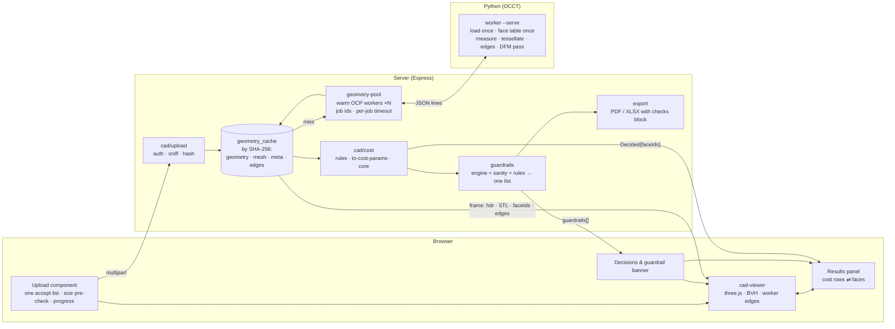
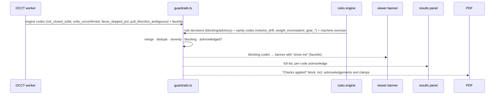
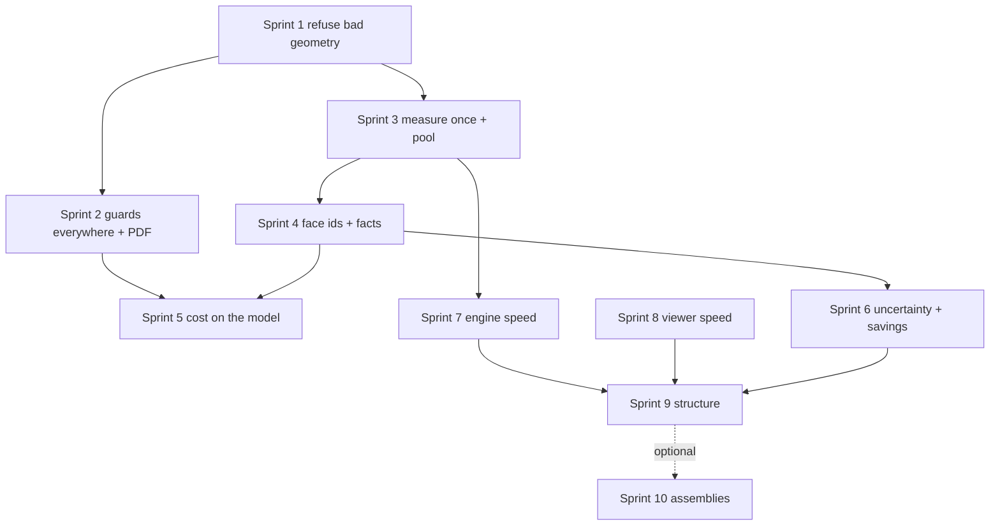

# CostVision CAD-to-Cost Viewer — Seven-Stage Review

**Scope:** the path from a CAD upload, through the OCCT geometry engine, into the cost engine, and back out to the 3D viewer and the report.
**Commit reviewed:** `2d37808` on `claude/new-session-ts4byp` · **Date:** 2 September 2026 · **Test suite at review:** 2,022 passing.

## How to read this document

Every factual claim carries a `file:line` citation into the codebase at the commit above and one of three tags:

- **[Certain]** — the cited line was read and says what is claimed.
- **[Likely]** — inferred from the code with high confidence but not executed.
- **[Live]** — reproduced by running the real engine or the real viewer code in this session. The commands and outputs are recorded in the appendix.

Nothing in this document is a code change. The seven stages are review, plan, and design. Where an effort figure appears it is an engineering estimate for sizing a backlog, not a commitment.

**What was run live for this review**

| What | How | Where the numbers appear |
|---|---|---|
| Geometry engine timing on 8 real STEP parts (0.6–31 MB) | `cad-geometry-engine.py` in both measurement and tessellation modes, wall time + peak RSS | Stage 2 |
| OCP import overhead | `python3 -c "import cadquery"` ×3 | Stage 2 |
| Browser-side viewer pipeline on the same 8 parts | the viewer's own `parseSTLMesh`, `toCreasedNormals(40°)` and `EdgesGeometry(24°)` in headless Chromium | Stage 2 |
| Mesh volume vs exact B-rep volume | signed-tetrahedron sum over the tessellated STL vs `BRepGProp` | Stage 4 |
| Topology check independent verification | `BRepCheck_Analyzer`, `ShapeAnalysis_FreeBounds`, degenerate-edge count via OCP | Stage 1, Stage 4 |
| Three engine probes | the same flange fixture (a) scaled to inches, (b) exported as a closed shell with no solid, (c) exported as an open surface with one face removed | Stage 1, Stage 4 |

**What was not checked:** the PDF/Excel exporters were not re-run for CAD content; the mobile build was not opened; no HTTP-level test of the CAD routes was executed (none exist in the suite either, see Stage 7); the negotiation and agent modules were out of scope.

---

# Stage 1 — Architecture review: CAD → OCCT → Cost Engine

## 1.1 What the system actually is

```
 Browser (src/ui)                              Server (server/)                            Python (OCCT / CadQuery)
 ┌───────────────────────────┐    multipart     ┌──────────────────────────────┐   spawn    ┌────────────────────────────┐
 │ CAD-to-Cost form          │ ──────────────▶  │ POST /api/cad/tessellate     │ ────────▶  │ cad-geometry-engine.py     │
 │  · file input (3 variants)│                  │   sniff → temp file → Python │            │  --stl in out --with-meta  │
 │  · drag/drop              │ ◀──────────────  │   ← binary STL + face meta   │ ◀────────  │  BRepMesh diag/500, 0.3rad │
 │                           │   [hdr][STL][ids]└──────────────────────────────┘            └────────────────────────────┘
 │ cad-viewer.ts (three.js)  │
 │  · parseSTLMesh (own)     │    multipart     ┌──────────────────────────────┐   spawn    ┌────────────────────────────┐
 │  · toCreasedNormals 40°   │ ──────────────▶  │ POST /api/cad/analyze        │ ────────▶  │ analyze(file)              │
 │  · EdgesGeometry 24°      │  cad + drawing   │   ext gate (no sniff)        │            │  10 face passes:           │
 │    (worker if >30k tris)  │  + 4 renders     │   STL → stl-parser.ts (TS)   │ ◀────────  │  classify, feature table,  │
 │  · 6 measure tools        │                  │   STEP/IGES → geometry-bridge│  JSON      │  pockets, wall rays, draft,│
 │  · section / explode      │                  │   ├─ deterministic (no AI)   │            │  setups, planar area,      │
 │  · 5 colour modes         │                  │   ├─ ai                      │            │  bends, gear, hardware     │
 └───────────┬───────────────┘                  │   └─ both (+diff)            │            └────────────────────────────┘
             │ window.__cadViewer               │   rules engine (TS, pure)    │
             │ highlightFaces(faceIds)          │   ├─ cost-input-rules/*      │   spawn    ┌────────────────────────────┐
 ┌───────────┴───────────────┐                  │   ├─ cad-sanity.ts           │ ────────▶  │ analyze(file) again,       │
 │ dfm-geometry-panel.ts     │ ◀── poll ──────  │   ├─ cad-machining-guard.ts  │  DFM job   │  CV_EXTRACT_FEATURES=1     │
 │  (background DFM job)     │                  │   └─ to-cost-params.ts       │            │  + per-face ray cast       │
 └───────────────────────────┘                  │ computeUniversalStack (core) │            └────────────────────────────┘
                                                └──────────────────────────────┘
```

Three facts define the architecture and they are all sound:

1. **The browser never parses STEP.** STEP/IGES is tessellated server-side and returned as a binary frame `[u32 headerLen][header JSON][binary STL][triFace u32[]]` (`src/ui/cad-viewer.ts:780-809`, produced at `server/routes/cad.ts:2050-2068`). STL is parsed in the browser by a hand-written parser, not three.js's `STLLoader` (`src/ui/cad-views.ts:21-59`). [Certain]
2. **Geometry is measured by OCCT, not by the mesh.** Volume and area come from `BRepGProp` on the B-rep (`server/utils/cad-geometry-engine.py:1562-1568`); holes and bosses come from exact cylinder radii and orientation, not from triangle heuristics (`py:22-95`). [Certain]
3. **The cost engine is pure and the rules engine is pure.** `computeUniversalStack` takes the rate library as an argument, and `tests/architecture-invariants.test.ts` scans `src/engine/**` for LLM and network imports (`src/engine/cost-input-rules/types.ts:9-12`). There is a fully deterministic mode with no AI, no key and no network (`server/routes/cad.ts:773-808`), and it is the **default** mode (`cad.ts:1696-1698`). [Certain]

That is a better foundation than most commercial CAD-to-cost tools have. The problems below are all about what happens around that core.

## 1.2 Findings by area

### A. CAD upload pipeline

| # | Finding | Evidence | Tag |
|---|---|---|---|
| A1 | **Every CAD endpoint is anonymous.** The CAD router is mounted with no middleware, and `cad.ts` never imports `requireAuth`, unlike `projects.ts:21`, `knowledge.ts:56`, `rate-library.ts:45`. | `server/index.ts:68`; `server/routes/cad.ts` (no import) | [Certain] |
| A2 | **`/reanalyze` trusts client-supplied geometry as measured truth** and has no rate limiter, while making two paid model calls. The body's `occtGeometry` becomes the cache key and is fed to `normalizeCADAnalysis` as `measured`. | `cad.ts:2137-2143`, `:2181-2185`, `:2343` | [Certain] |
| A3 | **Content sniffing runs on `/tessellate` only.** `sniffCadContent` (STEP must contain `ISO-10303-21` in the first 4 KB) is defined once and called once; `/analyze`, the route that spawns Python and then spends AI tokens, checks the extension and nothing else. `drawingPdf` is validated for nothing. | `cad.ts:1961-1981`, `:2038`, `:405-409`, `:403`, `:745` | [Certain] |
| A4 | **Uploads are in-memory, 250 MB each, two per request.** `multer.memoryStorage()` with `fileSize` only; `/analyze` accepts `cadFile` + `drawingPdf`, so one request can hold ~500 MB of heap. | `cad.ts:69-71`, `:394-397` | [Certain] |
| A5 | **The multipart field cap contradicts the route's own limits.** Busboy's inherited default is 1 MiB per text field, yet the route accepts four `renderViews` of 800,000 chars and an uncapped `partPhotoBase64`. A phone photo can fail the whole upload as a 400 "Field value too long". | `cad.ts:580`, `:572`, `:2432-2439`; `node_modules/busboy/lib/types/multipart.js:251-253` | [Likely] |
| A6 | **No `trust proxy` setting**, so behind the fly.io proxy every user shares one per-IP budget of 40 analyses per 10 minutes. | `cad.ts:112-114`; no `trust proxy` anywhere under `server/` | [Likely] |
| A7 | **No client-side size check on the CAD input**, while the drawing-PDF input does pre-check at 30 MB. The user uploads the whole file before the server cap answers. | `src/ui/main.ts:6220-6248` vs `:6166` | [Certain] |
| A8 | **Three upload affordances with three different `accept` lists.** The per-commodity inline input advertises `.brep` and `.obj`, which the viewer and the tessellate route both reject. | `index.html:726-731`; `main.ts:5862-5867`, `:10935`; `cad-viewer.ts:811-814`; `cad.ts:2035` | [Certain] |

### B. STEP / IGES / STL parsing

| # | Finding | Evidence | Tag |
|---|---|---|---|
| B1 | **IGES is read but never sewn.** `IGESControl_Reader` returns a compound of faces; there is no `BRepBuilderAPI_Sewing`, `ShapeFix` or `BRepCheck_Analyzer` anywhere in the engine, so an IGES surface model's "volume" is whatever `VolumeProperties` returns on an unstitched shell. | `py:1543-1549`; grep for `Sewing|ShapeFix|BRepCheck` returns nothing | [Certain] |
| B2 | **An open surface model is costed as if it were a solid, at a plausible-looking wrong volume.** Removing one face from the flange fixture and running the real engine: `status=success`, volume **50.2 cm³ against a true 63.9**, weights scaled accordingly, no error field, and `openShell=False`. | Probe C, appendix A.4 | [Live] |
| B3 | **An inch-unit model passes with no warning and a mass of 0.0 kg.** The unit check only fires below 0.5 mm or above 15 m; a 80 mm flange exported in inches measures 3.15 mm. | `py:830-840`; Probe A, appendix A.4 | [Live] |
| B4 | **The STL path fabricates wall-thickness statistics.** `minMm = wall × 0.5`, `maxMm = wall × 2.0`, `stdDevMm = wall × 0.3` are written into the same fields OCCT fills from ray casting, distinguished only by `method: 'stl_heuristic'`. | `cad.ts:484-490` | [Certain] |
| B5 | **The STL parser has no watertightness check.** `Math.abs(signedVolume)` turns an open or inverted mesh into a positive number. | `server/services/stl-parser.ts:268` | [Certain] |
| B6 | **`truncated` is dropped from the `/analyze` response.** An STL over 2 M triangles is silently under-measured; `/parse-stl` returns the flag, `/analyze` does not. | `stl-parser.ts:122-123`; `cad.ts:906-916` vs `:2126` | [Certain] |
| B7 | **Assembly detection is a text grep of the first 300 KB** for `= PRODUCT (`. It misses assemblies whose PRODUCT entities sit later, and its output is prose that no rule or status reflects. | `py:814-827`; `cad.ts:1291` | [Certain] |

### C. OCCT measurement pipeline

| # | Finding | Evidence | Tag |
|---|---|---|---|
| C1 | **The topology "open shell" signal is wrong in both directions.** `freeEdgeCount` counts edges with one face ancestor, which includes **degenerate edges** (cone apexes, surface poles). On the valid closed `Casting_Braket` it reports 17 free edges; independent OCP check: all 17 are degenerate, zero true free edges, `BRepCheck.IsValid=True`, zero free-bound wires. Meanwhile `openShell` is defined as `not enclosesSealedVoid`, so it is `True` on every plain solid and `False` on the genuinely open Probe C. | `py:333-347`; appendix A.3, A.4 | [Live] |
| C2 | **`_compute_draft_analysis` counts every flat bottom face as an undercut** (`angle > 90.5°` with no wall-face gate). The bug is documented and fixed in the newer per-face extractor, but the broken aggregate still feeds the prompt, the tooling cost model and the manufacturability score. | `py:557`, `:1190-1200`; `cad.ts:1306`; `py:1735`, `:1748` | [Certain] |
| C3 | **Ten separate full face traversals per analysis**, each rebuilding `BRepAdaptor_Surface` per face. | `py:1596`, `:1617-1618`, `:1630`, `:1636`, `:1655`, `:1661`, `:1721`, `:1724`, `:1767` | [Certain] |
| C4 | **Two different setup-time constants for the same quantity.** The engine uses 15 min/setup; `cad.ts` falls back to 45 when the estimate is missing. | `py:668-689`; `cad.ts:1397` | [Certain] |
| C5 | **Feature detection is well-designed where it exists.** Hole-vs-boss is by concavity (`REVERSED XOR Direct()`), not a radius threshold; a feature must sum ≥298° of arc, which correctly excludes pocket corner radii and slot ends; the wall-thickness sampler is seeded (`random.Random(20260401)`), so the same file measures the same wall every run. | `py:59-61`, `:80`, `:407` | [Certain] |
| C6 | **Every per-face loop has a bare `except: continue`.** A face that throws is silently absent from the count, and whole sub-analyses degrade to `None` with no signal in the HTTP response. | `py:72, 203, 265, 302, 374, 428, 509, 565, 620, 661, 1231`; `:826, 1610, 1631, 1637, 1656, 1667` | [Certain] |

### D. Geometry → Cost Engine data flow

| # | Finding | Evidence | Tag |
|---|---|---|---|
| D1 | **Geometry is measured up to four times per upload, with no geometry-level cache.** `/tessellate` for the four vision renders, `/analyze`, the DFM job, and the viewer's `?meta=bin`. The only cache keys on the entire request including overrides, so changing `annualVolume` re-spawns OCP for identical geometry. | `main.ts:6314`; `cad.ts:510`; `dfm-job-runner.ts:176`; `cad-viewer.ts:780`; `cad.ts:583-589` | [Certain] |
| D2 | **A zero-volume model yields a £0 costing with no warning.** `fillRatio` and all six weights go to 0; the volume-drift check is skipped because it requires `measuredVolumeCm3 > 0`; `netWeightKg` clamps to 0; `enforceGeometryCommodity` may reclassify the part to blow moulding. | `py:1578`, `:1687-1692`; `cad-sanity.ts:106`; `cad.ts:1150-1161`, `:307-349` | [Certain] |
| D3 | **An unreadable STEP returns HTTP 200 with a full costing.** The kernel failure is downgraded to a `console.warn`, `geometrySource` becomes `text_parsing`, and the route builds a machining analysis anyway. In AI mode the prompt then instructs the model to invent `volume = bbox × fill_factor`. | `cad.ts:518-522`, `:773-807`, `:1400-1404` | [Certain] |
| D4 | **Measured volume, area and bbox are not clamped to the measurement in the AI path.** Only `netWeightKg` is clamped, and only downward (an AI mass *below* measured passes). | `cad.ts:1049-1051`, `:1156-1161` | [Certain] |
| D5 | **Many measured fields are dead on arrival.** `edges.*`, `detectedHardware`, `manufacturingFeatures`, `assemblyWarning`, `unitWarning`, `threadFeaturesDetected`, `wallThickness.stdDevMm`, four of five draft fields, `castIronKg/copperKg/titaniumKg`, `sheetMetal.totalBendLengthMm`, invest wax/shell costs are computed and consumed by no rule. `RuleContext.geometryQuality` is declared, set, and read by nothing. | agent grep across `cost-input-rules/`; `types.ts:108` vs `cad.ts:1726` | [Certain] |
| D6 | **`cad-schema.ts` is dead on the live path.** `CAD_ANALYSIS_SCHEMA` is never referenced by `cad.ts`, which uses prompt-guided JSON + `extractJson` instead; the schema also lacks `castIron` that `normalizeCADAnalysis` writes. | `server/utils/cad-schema.ts:81-108`; `cad.ts:813-817`, `:1059` | [Certain] |
| D7 | **The deterministic path has fewer guards than the AI path.** `applyNearNetMachiningCap` runs after the deterministic branch has already returned, so deterministic casting and forging runs carry uncapped from-solid machining time. Both gear coherence checks are structurally dead there because `buildGeoSanityContext` is called without `aiOriginal`. | `cad.ts:807` vs `:874`; `cad.ts:783`, `:387-389`; `cad-sanity.ts:278` | [Certain] |
| D8 | **`assumeLeanings: true` is set unconditionally**, including on the deterministic path where an engineer is present, so `pressureTight`, `safetyCritical` and `toleranceClass` resolve to a leaning instead of blocking. The type's own comment says it must stay off wherever an engineer is present. The route comment explains the motive (avoid blocking every casting/forging line) but applies it to both paths. | `cad.ts:1734-1736`; `cost-input-rules/types.ts:124-129` | [Certain] |

### E. Rendering pipeline

| # | Finding | Evidence | Tag |
|---|---|---|---|
| E1 | **On-demand render loop, thorough disposal.** `invalidate()` schedules one frame; the loop self-terminates when damping settles. `dispose()` removes listeners, disconnects the observer, traverses and disposes, forces context loss, terminates the worker. This is genuinely good. | `cad-viewer.ts:638-682`, `:2019-2037` | [Certain] |
| E2 | **Edge-worker message race.** One shared worker; each call attaches its own `message` listener and resolves on the first message. Edge jobs are posted per body in a `forEach`, so on an assembly with two or more bodies over the threshold, every pending promise resolves with body 1's edge buffer and later replies are dropped. | `cad-viewer.ts:583-592`, `:910-922` | [Certain] |
| E3 | **The worker threshold is per body, not per model.** A 200-body assembly of 20k-triangle bodies runs `EdgesGeometry` on the main thread 200 times. | `cad-viewer.ts:575` | [Certain] |
| E4 | **Pixel ratio up to 2.5× when still, on top of MSAA.** On a 2× DPR display that is 6.25× the fragments of a 1:1 canvas. | `cad-viewer.ts:294-297` | [Certain] |
| E5 | **Five copies of the position buffer at peak** (parser output, `masterPositions`, per-body slice, creased position, creased normal): ~180 bytes per triangle. | `cad-viewer.ts:816`, `:874`, `:887`, `:891` | [Certain]; arithmetic [Likely] |
| E6 | **No acceleration structure for picking.** Every click is a linear raycast over every visible body, then two more O(n) passes over `triFaceAll`. | `cad-viewer.ts:1245-1248`, `:1501`, `:1527` | [Certain] |
| E7 | **"Fit" does not fit.** Camera distance is a fixed `partRadius × 2.6` ignoring aspect and fov. | `cad-viewer.ts:702-709` | [Certain] |
| E8 | **`Math.min(...thkVals)` spreads the face list** and will overflow the argument stack on a large assembly. | `cad-viewer.ts:967` | [Likely] |

### F. UI/UX for cost engineers (summary; full treatment in Stage 3)

The viewer has six measurement tools, three section planes, radial and axial explode, per-component move/rotate, five colour modes with legends, a resizable model tree, and a face chip that prints exact B-rep radius and area on click (`cad-viewer.ts:1233`, `:722-756`, `:1113-1141`, `:1620-1694`, `:1051-1107`, `:1528-1544`). That is a serious tool. What it lacks is the thing that would make it a *cost* tool: no cost driver can be traced to a face, and no face can change a cost input (see D5, G3).

### G. Guardrail surfacing

| # | Finding | Evidence | Tag |
|---|---|---|---|
| G1 | **No guardrail reaches the PDF.** `CADReportMeta` has no field for sanity warnings, rule overrides, provenance or open decisions. A grep for `sanity` in `src/export/` returns one comment. | `src/export/pdf.ts:74-102` | [Certain] |
| G2 | **The 3D view never shows a guardrail.** All sanity, blocking and machining-guard output renders in the results panel in `main.ts` only. | `main.ts:6693-6706`, `:6504-6564`, `:14564-14571`; grep of `cad-viewer.ts` | [Certain] |
| G3 | **The viewer is a dead end for cost.** `CADViewerOptions` has no `onFaceSelect`; no cost-bearing structure (`OperationPlan`, `FeatureCostLine`, `featureTable` rows) carries `faceIds`; the only face-indexed measurement (`manufacturingFeatures`) is consumed by no costing rule. Measurements never reach `collectInput()`. | `cad-viewer.ts:55-58`, `:1514-1546`; `commodities/machining.ts:154-162`; `feature-costing.ts:25-32`; `main.ts:6643-6647` | [Certain] |
| G4 | **When no machine fits, the part is silently costed on the largest machine of the class.** The only trace is a parenthetical in a detail string. Only the gear picker refuses. | `routing-optimiser.ts:118-120`, `:180`; `machine-sizing.ts:20-23` vs `:172-186` | [Certain] |
| G5 | **The server never refuses to cost on an open blocking decision**; the gate lives only in the browser, and one `window.confirm` acknowledges every blocking sanity code at once. | `cad.ts:773-807`; `main.ts:14580-14594`, `:14564-14572` | [Certain] |
| G6 | **`window.__cadViewer` is never cleared on dispose**, so DFM highlight clicks report "Highlighted N face(s) in the 3D viewer" into a destroyed viewer. | `main.ts:17389-17391`, `:17401-17407` | [Certain] |

### H. Workflow alignment with the AUTO pipeline (summary; full treatment in Stage 5)

The rules engine is pure, ordered, and records provenance per value (`engine.ts:39-103`, `types.ts:32-45`). But: Monte-Carlo bands ignore that provenance entirely (`uncertainty.ts:42-49`); the VAVE lever generator never re-costs through the engine (`idea-levers.ts:18-20`); DFM cost impact is a feature-cost model, not a re-cost, and 15 of 19 rules have no pricer (`dfm-geometry/cost-impact.ts:216-243`); and the DFM job is fed the form's material/process rather than the rules' answered family, and never the region (`cad.ts:800-802`; `dfm-job-runner.ts:218-222`).

### I. Error handling for bad CAD files

Traced outcomes for the six classic bad inputs:

| Input | What happens | Client sees | Tag |
|---|---|---|---|
| 0-byte `.stl` | parser throws → 422 | clear error | [Certain] |
| 0-byte `.step` | no sniff; `STEPControl_Reader` fails; route continues with `text_parsing` | **200 + a costing** | [Certain] |
| Truncated binary STL | throws if short by >50 bytes; otherwise `RangeError` | 422 | [Certain] |
| Open surface STEP | measured as a solid | **200, volume 21% low, no warning** | [Live] |
| Inch-unit STEP | bbox 3.15 mm, weights 0.0 | **200, no warning** | [Live] |
| Multi-solid assembly | text grep of first 300 KB; prose warning; merged volume | 200, prose only | [Certain] |
| Corrupt STL in the browser | `parseSTLMesh` throws before any status write; mount handler `console.warn`s | **viewer says "No file loaded"** | [Certain] |

The pattern is consistent: the pipeline is excellent at not crashing and poor at refusing. `_runPython` never rejects — every failure is a value (`geometry-bridge.ts:213-216`), and the route turns values into warnings.

### J. Architecture quality

- **Good:** pure engine and rules; deterministic default; seeded sampling; on-demand rendering; thorough disposal; `asyncRoute` closes the Express-4 async hole (`cad.ts:1994-2002`); `extractJson` scans for a balanced object (`cad.ts:962-982`); every async continuation in the viewer is guarded by a `loadSeq` staleness check (`cad-viewer.ts:760-761`).
- **Structural debt:** `cad.ts` is 2,443 lines and mixes upload, sniffing, prompt building, normalisation, sanity, cache, and three route handlers; `main.ts` holds viewer wiring across ~10 sites; two DFM systems coexist (`cost-input-rules/dfm.ts` and `dfm-geometry/`) with different outputs and no reconciliation; `cad-schema.ts` is dead; `buildBodiesPanel` is dead code that `buildTreePanel` still writes into (`cad-viewer.ts:1037-1040`, `:1089-1090`).
- **Process management:** the Python semaphore can over-subscribe. `release()` decrements then resolves a queued waiter on a later microtask; a fresh caller slips through in between and both increment, so three OCP processes can run under `MAX_CONCURRENT_PYTHON = 2`. The queue is unbounded and untimed. `/analyze` passes a 120 s timeout to Node but the Python child still reads the unmodified 300 s env, so Node's SIGKILL always wins and the documented "clean error beats the kill" contract never holds. (`geometry-bridge.ts:49-61`, `:42-47`; `cad.ts:510`; `py:17`) [Certain]

## 1.3 Prioritised roadmap

Priority is by *cost-number risk first*, then user-visible breakage, then performance.

| P | Item | Why first | Findings |
|---|---|---|---|
| **P0** | Refuse to cost when geometry is not a closed solid: run `BRepCheck_Analyzer` + `ShapeAnalysis_FreeBounds`, count only non-degenerate free edges, and return `status:'error'` with a reason. Same for `volume ≤ 0`. | Today an open surface costs at a plausible wrong number and a zero-volume part costs £0, both silently. | B1, B2, C1, D2 |
| **P0** | Unit heuristic: flag any part whose bbox is under 25 mm on every axis *and* whose feature radii are sub-millimetre, and require a unit confirmation decision. | Inch models are common from US suppliers and produce a 16,387× error with no warning. | B3 |
| **P0** | Make OCCT failure a 4xx on `/analyze`, not a `text_parsing` fallback; put the CAD router behind `requireAuth`; rate-limit and stop trusting `/reanalyze` geometry. | A costing built on nothing returns 200. Anonymous, paid endpoints. | D3, A1, A2 |
| **P1** | One measurement per file: hash the upload, run the engine once, cache `{geometry, mesh, meta}` by hash with a TTL; every route reads the cache. | Up to 4 spawns per upload, each paying ~3 s of OCP import; the semaphore is 2. | D1, Stage 2 |
| **P1** | Guardrails on both paths and in the report: move `applyNearNetMachiningCap` and the gear checks ahead of the branch; add a sanity block to `CADReportMeta`; surface blocking codes in the viewer as a banner. | Deterministic path is the default and has fewer guards than the AI path; nothing reaches the PDF. | D7, G1, G2 |
| **P1** | Fix the topology signal (degenerate-edge filter, rename `openShell` to what it measures) and retire the aggregate draft function in favour of the per-face one. | Wrong in both directions today; feeds tooling cost and manufacturability. | C1, C2 |
| **P1** | Viewer correctness: edge-worker job ids, per-model threshold, clear `window.__cadViewer` on dispose, status text on STL parse failure, real fit. | Assemblies get wrong edges; corrupt STL is silent. | E2, E3, G6, E7 |
| **P2** | Semaphore and timeout fixes; propagate the timeout into the child env; bound the queue. | Over-subscription under load. | J |
| **P2** | Face ids on cost-bearing structures and an `onFaceSelect` callback; provenance-aware Monte Carlo. | Makes the viewer a cost tool. | G3, H |
| **P3** | Delete dead code (`cad-schema.ts`, `buildBodiesPanel`), unify the two DFM systems, split `cad.ts`. | Maintainability. | J |

---

# Stage 2 — Performance optimisation: CAD upload + measurement

## 2.1 Where the time actually goes — measured

All numbers below were produced in this session on the eight real STEP parts under `cad-audit/parts/`, on a 4-core container with 16 GB RAM, using the exact engine and viewer code at the reviewed commit. [Live]

### Server side: `cad-geometry-engine.py`

| Part | File | B-rep faces | `analyze` wall | `--stl` tessellate wall | Triangles out |
|---|---:|---:|---:|---:|---:|
| test-gear-m3-z38 | 1.2 MB | 155 | 2.1 s | 2.6 s | 9,416 |
| steering_knuckle_RH | 0.6 MB | 310 | 2.7 s | 2.7 s | 18,448 |
| Casting_Braket | 0.7 MB | 230 | 2.9 s | 2.5 s | 14,503 |
| Part1 | 0.9 MB | 248 | 2.4 s | 2.6 s | 18,018 |
| PRCR002 | 1.0 MB | 364 | 3.6 s | 3.6 s | 28,034 |
| Seat_Locking_Bracket | 3.0 MB | 426 | 3.9 s | 7.0 s | 23,766 |
| BUMPER | 20.2 MB | 498 | 11.8 s | 11.6 s | 24,427 |
| Fuel_tank | 31.1 MB | 3,444 | **33.3 s** | **99.2 s** | 163,192 |

Peak resident memory across the run climbed from 316 MB (first small part) to **699 MB** (fuel tank tessellation). Bare `python3` starts in 0.02 s.

**The number that matters most:** `python3 -c "import cadquery"` alone takes **2.9–4.0 s** (three runs: 3.98, 3.29, 2.87 s). For every part under about 1 MB the *entire* measurement is the interpreter loading OCP; the geometry work is sub-second. Every spawn pays that tax, and Stage 1 D1 established there are up to four spawns per upload.

Worked example, one fuel-tank upload today: tessellate for the vision renders (99 s) + analyze (33 s) + DFM job (33 s + per-face rays) + viewer `?meta=bin` (99 s) ≈ **4.4 minutes of Python CPU**, two at a time through a semaphore of 2, against a 300 s per-call timeout and a 120 s timeout on `/analyze` that the child cannot honour (Stage 1 J).

### Browser side: the viewer's own pipeline in headless Chromium

Measured with the viewer's real `parseSTLMesh` (`src/ui/cad-views.ts:21`), `toCreasedNormals(40°)` (`cad-viewer.ts:286-289`) and `EdgesGeometry(24°)` (`cad-edges-worker.ts`) on the STLs the server produced:

| Part | Triangles | parse | creased normals | **EdgesGeometry** | total | edge segments |
|---|---:|---:|---:|---:|---:|---:|
| test-gear-m3-z38 | 9,416 | 5 ms | 25 ms | 46 ms | 76 ms | 1,680 |
| Casting_Braket | 14,503 | 1 ms | 10 ms | 64 ms | 74 ms | 1,281 |
| Part1 | 18,018 | 1 ms | 10 ms | 101 ms | 112 ms | 2,522 |
| steering_knuckle_RH | 18,448 | 1 ms | 17 ms | 135 ms | 153 ms | 3,128 |
| Seat_Locking_Bracket | 23,766 | 1 ms | 26 ms | 149 ms | 175 ms | 2,986 |
| BUMPER | 24,427 | 1 ms | 12 ms | **267 ms** | 280 ms | 2,768 |
| PRCR002 | 28,034 | 3 ms | 49 ms | 127 ms | 180 ms | 5,483 |
| Fuel_tank | 163,192 | 6 ms | 121 ms | **980 ms** | 1,107 ms | 4,175 |

Two conclusions:

1. **Parsing is free; edges are the cost.** `EdgesGeometry` is 60–90 % of client time at every size. It is an O(n log n) sort-and-hash over every edge, and three.js's implementation allocates per edge.
2. **The 30,000-triangle worker threshold is set on the wrong side of the freeze.** Seven of eight real parts are *below* it (`cad-viewer.ts:241`), so they run on the main thread and block input for 74–280 ms — a visible hitch at the exact moment the user is watching the part appear. Only the fuel tank goes to the worker.

The `STL` fast path on the server (`stl-parser.ts`) parses the same meshes in **3–7 ms**. It is not the problem.

## 2.2 Optimisation plan, by expected gain

### O1 — A warm geometry worker (removes the 3 s import from every call)

Replace one-shot `spawn(python3, [script, file])` (`geometry-bridge.ts:194`) with a small pool of long-lived Python processes that import OCP once and read jobs from stdin as JSON lines.

```ts
// server/utils/geometry-pool.ts — sketch
class GeometryWorker {
  private child = spawn(PYTHON_BIN, [PYTHON_SCRIPT, '--serve'], { stdio: ['pipe','pipe','pipe'] });
  private pending = new Map<string, { resolve: (v: unknown) => void; timer: NodeJS.Timeout }>();
  constructor() { readline.createInterface({ input: this.child.stdout }).on('line', l => this.onLine(l)); }
  run(job: { id: string; op: 'analyze' | 'tessellate'; path: string; env?: Record<string,string> }, timeoutMs: number) {
    return new Promise((resolve) => {
      const timer = setTimeout(() => { this.pending.delete(job.id); this.child.kill('SIGKILL'); this.respawn(); resolve({ status: 'error', error: `timeout ${timeoutMs}ms` }); }, timeoutMs);
      this.pending.set(job.id, { resolve, timer });
      this.child.stdin.write(JSON.stringify(job) + '\n');
    });
  }
}
```

On the Python side, `--serve` is a loop over `sys.stdin` that calls the existing `analyze()` / `tessellate_to_stl()` and prints one JSON line per job. The per-job `signal.alarm` stays, but is now set from the job's own timeout, which also fixes the inverted timeout ladder (Stage 1 J).

**Expected gain:** small parts go from ~2.5 s to well under 1 s wall; the fuel tank loses ~3 s per call. Memory: each warm worker holds ~300 MB RSS idle (the measured floor above), so pool size = `MAX_CONCURRENT_PYTHON` = 2 by default and it should be sized against the 2 GB Fly VM.

**Risk:** a native OCCT crash takes the worker down mid-job. The pool must treat a closed stdout as failure for all pending jobs and respawn — the sketch above does that on timeout; the `exit` handler needs the same.

### O2 — Measure once, serve four times (removes 2–3 of the 4 spawns)

Hash the uploaded bytes (SHA-256 is already computed for the analysis cache, `cad.ts:583`). Introduce a `geometry_cache` keyed by that hash holding `{ occtGeometry, meshBuffer, meta, measuredAt, engineVersion }`. Then:

- `/tessellate`, `/analyze`, the DFM job and `?meta=bin` all call `getOrMeasure(hash, buffer)`.
- The DFM job's `CV_EXTRACT_FEATURES=1` pass becomes a *second stage* over the cached shape inside the warm worker, not a fresh file read.
- The analysis cache key drops the raw file bytes and keys on `geometryHash + overrides` instead, so changing `annualVolume` never re-measures.

**Expected gain:** fuel tank per-upload Python time falls from ~4.4 min to ~2.2 min (one tessellate + one analyze), and to ~1.7 min once the DFM pass shares the loaded shape. For small parts the second, third and fourth calls become cache hits in the low milliseconds.

### O3 — One traversal, not ten (cuts `analyze` time on large B-reps)

`analyze()` walks every face in ten separate passes (Stage 1 C3). Build the per-face record once:

```python
@dataclass
class FaceRec:
    idx: int; face: TopoDS_Face; kind: str; adaptor: BRepAdaptor_Surface
    area: float; normal: Optional[gp_Dir]; radius: Optional[float]; orientation: TopAbs_Orientation
    uv_mid: Tuple[float,float]; bbox: Bnd_Box

def build_face_table(shape) -> List[FaceRec]: ...   # one TopExp_Explorer, one GProp per face
```

and let `_classify_faces`, `_extract_feature_table`, `_extract_machining_features`, `_compute_draft_analysis`, `_compute_setup_count`, `_compute_planar_face_area`, `_detect_bends` and `_gear_metrics` take the table. The 3,444-face fuel tank currently constructs ~34,000 `BRepAdaptor_Surface` objects; the table constructs 3,444.

**Expected gain:** the measurement portion of `analyze` on the fuel tank (33 s total, of which ~3 s is import and ~5 s is STEP read) should roughly halve. Small parts are unaffected because they are import-bound.

### O4 — Move edge extraction off the main thread for every part, and compute it once

- Set `EDGE_WORKER_THRESHOLD` (`cad-viewer.ts:241`) to 0: always use the worker. The measured main-thread cost is 74–280 ms for ordinary parts, which is exactly the range users perceive as a stutter.
- Give each job an id and route replies by id, fixing the race (`cad-viewer.ts:583-592`). Batch all bodies into **one** post so the worker computes edges for the whole model in a single message, which also fixes the per-body threshold (`:575`).
- Better still, compute edges **server-side once** during tessellation: the B-rep already knows its edges exactly. Emit a `[edgeCount][edge xyz pairs]` block in the existing binary frame (`cad.ts:2050-2068`) from `TopExp_Explorer(TopAbs_EDGE)` + `BRepMesh` polygon-on-triangulation. That gives *true* feature edges from the B-rep rather than a 24° dihedral heuristic, and it is cached by O2.

**Expected gain:** zero main-thread edge work; fuel tank saves ~1 s of client time per load; assemblies stop rendering the wrong edges.

### O5 — Memory: stop copying the mesh five times

`positions` → `masterPositions` → per-body `slice()` → creased positions → creased normals (`cad-viewer.ts:816`, `:874`, `:887`, `:891`). Reorder into per-body runs **in place** with the counting sort already present (`:866-880`) writing into one output buffer, then create per-body `BufferGeometry` objects as *views* (`new BufferAttribute(positions.subarray(a, b), 3)`) rather than copies. Compute creased normals into a preallocated buffer.

**Expected gain:** ~5× → ~2× the triangle payload in JS heap. On a 5 M-triangle assembly that is the difference between ~900 MB and ~360 MB.

### O6 — Rendering: cap pixel ratio and add a BVH

- `pixelRatio()` returns `min(dpr × 1.5, 2.5)` when still (`cad-viewer.ts:294-297`). Cap at `min(dpr, 2)` and drop MSAA to 4× above 500k triangles. Expected gain: 2–3× fewer fragments on Retina-class displays, no visible loss with FXAA-free line rendering already used.
- Add `three-mesh-bvh` (`MeshBVH`, `acceleratedRaycast`) per body. Picking on the fuel tank goes from a 163k-triangle linear scan per click to a log-depth traversal. Expected gain: sub-millisecond picks; makes hover-highlight feasible.
- Stop allocating in `scaleLabels()` every frame (`:628-636`); cache the sprite list on change.

### O7 — Large-assembly handling

The pipeline has no concept of an assembly beyond a text grep (Stage 1 B7). For assemblies:

- Use `STEPCAFControl_Reader` with an XDE document so each product occurrence is a node with a transform, name and colour. Tessellate each **unique** shape once and instance it (`InstancedMesh` on the client) — a fastener used 200 times is one mesh.
- Stream: return the frame per body as chunked transfer and render bodies as they arrive, with a progress fraction in the status bar. Today there is no progress signal at all (`cad-viewer.ts:769`, `:939`).
- Client-side LOD: for bodies under 0.5 % of screen area, render the bbox only.

### O8 — Observability so the next review has numbers without a benchmark harness

There is no timing around `analyzeGeometry`, `tessellateToSTL`, the model calls or the rules engine (`cad.ts:517`), and no `performance.now()` in the viewer. Add `timings: { readMs, measureMs, tessellateMs, rulesMs, aiMs }` to the `/analyze` response and a `viewer.load` event with `parseMs / normalsMs / edgesMs / firstFrameMs` to the existing telemetry route.

## 2.3 Prioritised optimisation roadmap

| Order | Item | Gain | Effort (est.) | Depends on |
|---|---|---|---|---|
| 1 | O2 measure-once cache | −2 to −3 spawns per upload; makes everything else cheaper | 3–4 days | — |
| 2 | O1 warm worker pool | −3 s per call, fixes the timeout ladder | 3–4 days | — |
| 3 | O4a worker for all parts + job ids | removes visible stutter; fixes wrong edges on assemblies | 1 day | — |
| 4 | O8 timings | evidence for everything after | 1 day | — |
| 5 | O3 single face table | ~2× on large B-reps | 4–6 days | O1 |
| 6 | O4b server-side true edges | exact edges, zero client cost | 2–3 days | O2 |
| 7 | O5 in-place buffers | ~2.5× less client heap | 2 days | — |
| 8 | O6 pixel ratio + BVH | smoother on Retina; instant picking | 2 days | — |
| 9 | O7 assembly instancing + streaming | large assemblies at all | 8–12 days | O1, O2, O4b |

Everything above is measured against the eight parts in this session; the same harness (`scratchpad/cadbench/bench.py`, `run-browser-bench.mjs`, reproduced in appendix A) should be re-run after each item so the gain column becomes fact rather than estimate.

---

# Stage 3 — UI/UX improvement roadmap (cost-engineering focus)

## 3.1 What the August study asked for, and what shipped

The July/August study (`build_cad_viewer_study_js.js`, deck `CostVision-3D-CAD-Viewer-Study-and-Roadmap.pptx`) diagnosed the viewer as "we already measure it — we just don't show it" and laid out four phases. Checked against `git log -- src/ui/cad-viewer.ts` at the reviewed commit:

| Study item | Status at `2d37808` | Evidence |
|---|---|---|
| Bigger canvas, fullscreen, drag-to-resize | **Shipped** (C1 sidebar clash fix, resizable tree 190–460 px) | `e0bf824`; `cad-viewer.ts:1777-1790` |
| Paint the wall-thickness we already compute | **Shipped** as a jet-ramp vertex-colour mode with legend | `cad-viewer.ts:154-168`, `:1620-1694` |
| Draft/undercut shading per face | **Shipped** | `cad-viewer.ts:140-148` |
| Feature tree / model tree, CATIA-style dock | **Shipped** (C2) | `3d5c4f0`; `cad-viewer.ts:1051-1107` |
| Orientation cube | **Shipped** (`ViewHelper`) | `cad-viewer.ts:482-485` |
| Exploded view | **Shipped**, radial and axial, plus per-component move/rotate (C4, C5) | `ce04a6d`, `9361f56`; `cad-viewer.ts:1113-1155` |
| Multi-section | **Shipped**: three independent planes | `cad-viewer.ts:722-756` |
| Richer measure (distance, 3-pt circle, angle, point, face-to-face) | **Shipped**, six tools, CSV export, persisted per file | `cad-viewer.ts:1233`, `:1319-1334`, `:218-232` |
| Click a feature row → face lights up | **Shipped** (one-way, from the DFM panel) | `main.ts:17366-17379` |
| **Per-face → cost** (click a face, see its cost) | **Not shipped** | Stage 1 G3 |
| PMI / GD&T from STEP AP242 | **Not shipped** | no `XCAFDoc`/`STEPCAFControl` in the engine |
| Fillet/chamfer/slot/thread recognition on the costing path | **Partly**: fillets exist in `_extract_manufacturing_features` behind `CV_EXTRACT_FEATURES=1`, consumed only by the DFM job | `py:1264-1270`; Stage 1 D5 |
| Report feature tables click-linked to the model | **Not shipped** | `pdf.ts` has no face ids |

So Phase 0 and Phase 1 of that study are done, and done well. The remaining gap is the one that turns a good viewer into a cost tool.

## 3.2 Benchmark against the four reference viewers

Sources for the competitor columns: [Autodesk Viewer tools](https://help.autodesk.com/view/ADSKVIEWER/ENU/?guid=ADSKVIEWER_Help_AutodeskViewerTools_html), [Autodesk SVF2 streaming format](https://aps.autodesk.com/blog/update-svf2-ga-new-streaming-web-format-forge-viewer-now-production-ready), [Onshape view-only toolbar](https://cad.onshape.com/help/Content/viewonlytoolbar.htm?cshid=Viewer) and [measure tool](https://cad.onshape.com/help/Content/View/measure_tool.htm), [eDrawings Viewer](https://www.edrawingsviewer.com/product/edrawings-viewer) and [Professional](https://www.edrawingsviewer.com/product/edrawings-professional), [FreeCAD 1.0 measure tool](https://blog.freecad.org/2025/01/20/tutorial-using-the-measure-tool-in-version-1-0/). Ratings for CostVision are from the code; ratings for the others are from their public documentation and are feature presence, not quality judgements.

| Capability | CostVision | Autodesk Viewer | Onshape (view-only) | FreeCAD | eDrawings |
|---|---|---|---|---|---|
| Runs in a browser, no install | ● | ● | ● | ○ | ○ (Pro has web share) |
| Loads STEP/IGES | ● (server tessellation) | ● (70+ formats via Model Derivative) | ● | ● | ● |
| Progressive / streamed loading of large models | ○ (one binary frame, no progress) | ● (SVF2) | ● | ○ | ○ |
| Model/part tree | ● | ● (Model Browser + Properties) | ● | ● | ● |
| Measure: distance, angle, radius | ● (+ 3-pt circle, point, face-to-face) | ● | ● (+ area, mass) | ● (+ centre of mass) | ● |
| Section views | ● (3 planes) ○ (no capping fill) | ● (plane and box) | ● (any flat/circular entity) | ● | ● (dynamic, drag on screen) |
| Exploded view | ● | ● | ● (authored in assembly) | ○ | ● |
| Markup / comments | ○ | ● | ● (publications) | ○ | ● |
| Model compare / diff | ○ (rule-vs-AI diff only, `cad-diff-panel.ts`) | ● | ○ | ○ | ○ |
| Wall-thickness heatmap | ● | ○ | ● (thickness analysis) | ○ | ○ |
| Draft analysis on the model | ● | ○ | ● | ○ | ○ |
| Exact B-rep values on click (Ø, R, area) | ● | ● (Properties) | ● | ● | ● |
| **Cost driver → face highlight** | ○ | n/a | n/a | n/a | n/a |
| **Face → cost input** | ○ | n/a | n/a | n/a | n/a |
| Guardrail / DFM warning shown in the 3D view | ○ (results panel only) | n/a | n/a | n/a | n/a |
| Upload progress and size feedback | ○ | ● | ● | n/a | n/a |
| Error state for a bad file | ◐ (STL path silent) | ● | ● | ● | ● |
| Keyboard shortcuts documented | ◐ (a few, `keydown` handler) | ● | ● | ● | ● |

● present · ◐ partial · ○ absent · n/a not a cost tool

Read across the rows: on pure viewing CostVision is already at parity with the free tier of every reference and ahead of two of them on analysis overlays. The rows where it is behind are all *feedback* rows — progress, error state, guardrails in view — and the two rows nobody else has are exactly the ones a cost engineer would pay for.

## 3.3 Roadmap, in the order a cost engineer would notice

### U1 — Upload experience (fix the first thirty seconds)

- One `accept` list, shared by all three inputs, generated from the server's `SUPPORTED_EXTS` (Stage 1 A8).
- Client-side size pre-check against a `/api/cad/limits` endpoint that returns `maxUploadMb` (mirrors the drawing-PDF check at `main.ts:6166`).
- A real progress bar: `XMLHttpRequest.upload.onprogress` or `fetch` with a `ReadableStream` body for the upload, then a server-sent status for *measuring*, *tessellating*, *costing*. Today the only text is `Tessellating <file>…` (`cad-viewer.ts:769`) and then silence for up to 99 s on a large part (Stage 2).
- Reject unsupported native formats with the same helpful message on every route (`cad.ts:2027-2033` has it; `/analyze` does not).

### U2 — Measurement feedback (progress, errors, warnings)

- Every failure writes to the status bar, including the STL branch (`cad-viewer.ts:765-767` writes nothing before `parseSTLMesh` can throw).
- A **geometry quality badge** next to the filename: `closed solid · 1 body · mm`, or `⚠ open surface · 25 free edges`, or `⚠ units unconfirmed (bbox 3.2 mm)`. The data exists (`topology`, `unitWarning`) and is currently unread by anything (Stage 1 D5). This badge is where P0 findings B2 and B3 become visible to the person who can act on them.
- The status bar's `⚠ surface model (no closed solid)` (`cad-viewer.ts:936`) should be driven by the corrected topology signal (Stage 4 T1), not the current one, which says "open" on every solid.

### U3 — Part tree clarity

- Rename "Bodies / Features / Faces by type" to what the cost engineer is looking for: **Bodies**, **Cost features** (holes, bosses, pockets, bends, gear teeth with count and size), **Surfaces**.
- Each cost-feature row carries the £ it contributes once Stage 5 W1 lands, sorted by cost descending, so the tree doubles as a cost-driver list.
- Remove the dead floating Bodies panel (`cad-viewer.ts:1037-1040`) and the tree's write into it (`:1089-1090`).
- Persist tree width and open state; only measurements, toolbar order and collapse are persisted today (`:218-232`, `:1793-1846`).

### U4 — Section and exploded views

- **Capping fill** on section planes so a sectioned casting shows solid material rather than a hollow shell; the standard stencil-buffer approach works with three.js clipping planes and is what makes wall thickness legible in section.
- Apply clipping to the grid and bbox helper as well as the bodies (`:749-755` misses them).
- Exploded view: label each body on explode and let a click in the tree drive the explode of *that* body only — the per-component move tool already has the transform (`:1756-1760`).

### U5 — Feature-detection visualisation

- Pockets and bends are measured (`py:98-214`, `:217-272`) but only holes and bosses are grouped in the Features panel (`cad-viewer.ts:1216-1219`). Show all five kinds with a distinct colour per kind in the face-type mode.
- Thin-wall hot spots (`py:1354-1356`) should paint on the model as a red overlay, not just appear as DFM rows. The face ids are already in `ManufacturingFeature` (`ai-analysis.ts:13`).
- Fix highlights that ignore explode/rotate/move (Stage 1, viewer defect 5: the overlay is built from part-space `masterPositions`, `cad-viewer.ts:1504-1510`). Build the highlight per body and parent it to the body mesh so it inherits transforms.

### U6 — OCCT measurement display

- The face chip already prints *(exact, from B-rep)* values (`:1528-1544`). Extend it with the thing a cost engineer asks next: **"what does this face cost?"** — machining minutes from `featureMinutesEach` for holes/pockets, coating area share for external faces, and which operation it lands in (Stage 5 W1 supplies the mapping).
- Disclose the wall-thickness method in the legend: the per-face value is a *single ray at the face centroid* (`cad-viewer.ts:151`, `:33`); the aggregate is 30 seeded samples (`py:381`). Add the missing "no data" swatch (`NO_THICKNESS_COLOR`).

### U7 — Guardrail warnings in the view

- A banner strip across the top of the canvas for **blocking** codes (`weight_inconsistent_*` > 50 %, `process_geometry_implausible`, `gear_teeth_mismatch`) with the code, the two numbers in conflict, and a *Show me* link that highlights the faces involved where face ids exist (gear tip faces, thin-wall faces).
- Machine-envelope guard: when `oversize: true` (`routing-optimiser.ts:118-120`), draw the chosen machine's envelope as a wireframe box around the part so the overflow is visible, and make it a blocking decision (Stage 5 W3).
- Physics caps: when `near_net_machining_capped` fires, show the capped and uncapped hours side by side in the chip.

### U8 — Cost-driver highlighting

This is the row nobody else has and the study's Phase 2 target.

- **Cost → geometry:** each operation, feature cost line and coating stage carries `faceIds`; clicking a cost row in the breakdown highlights those faces and dims the rest. Requires Stage 5 W1.
- **Geometry → cost:** `onFaceSelect(faceId, faceMeta)` on `CADViewerOptions`; the results panel scrolls to and flashes the rows that face contributes to.
- A **"top 5 cost faces"** toggle that paints a cost heat map: per-face £ = machining minutes × rate + coating area × £/m² + feature-specific tooling share. Same vertex-colour engine as the thickness map (`applyColorMode`, `:1620-1694`).

### U9 — Loading indicators

- Determinate progress for upload and tessellation (U1), indeterminate for measuring with the stage name, and a first-frame skeleton (bbox wireframe from the header, which arrives before the mesh) so the user sees *something* within 200 ms of the frame's first bytes.
- On the STL path, `parseSTLMesh` takes 1–6 ms (Stage 2); the wait is edges. Render the mesh first and add edges when the worker returns, rather than holding the first frame for both.

## 3.4 Ordering

| Order | Item | Why here | Effort (est.) |
|---|---|---|---|
| 1 | U2 quality badge + status on every failure path | Makes the P0 geometry refusals visible; cheapest honesty win | 2 days |
| 2 | U1 upload progress, one accept list, size pre-check | First-30-seconds experience; unblocks large-part use | 2–3 days |
| 3 | U7 blocking-code banner + oversize envelope box | Guardrails finally in the place the engineer is looking | 3 days |
| 4 | U5 all feature kinds painted; transform-correct highlights | Uses measurements already paid for | 3 days |
| 5 | U8 cost ↔ face, both directions | The differentiator; needs Stage 5 W1 | 6–8 days after W1 |
| 6 | U4 capping fill, U3 tree rename/persist, U6 method disclosure | Polish that makes it feel like CAD software | 4–5 days |
| 7 | U9 skeleton-first, edges-after | Perceived speed | 1–2 days |

---

# Stage 4 — OCCT integration improvements (geometry → cost engine)

## 4.1 Geometry transfer: viewer → OCCT

There is no viewer → OCCT transfer and there should not be one. The browser holds a mesh; OCCT holds the B-rep; the B-rep is the truth. What *does* need to flow is identity: the viewer knows triangles by `triFace` id (`cad-viewer.ts:800-810`) and the engine knows faces by explorer index (`py:1245`). Those two indices are the same integer today only by construction — both come from one `TopExp_Explorer(TopAbs_FACE)` walk in the same process — and nothing asserts it.

**T0 — Make face identity a contract.** The tessellation sidecar should carry `faceIndexOrigin: 'TopExp_Explorer(TopAbs_FACE), 1-based'` and a per-face hash (`BRepTools.Hash` or the face's shape TShape pointer within the run) so that a measurement result and a mesh produced in *different* runs (Stage 2 O2 cache) can be checked for agreement before face ids are used for highlighting. Without it, a cache that pairs a mesh from one engine version with geometry from another silently mis-highlights.

## 4.2 Topology extraction — what is wrong and the fix

**T1 — Replace `_topology_signals` with a real validity report.** Verified live in this session (appendix A.3, A.4):

| Model | Engine says | Independent OCP check |
|---|---|---|
| `Casting_Braket` (valid closed casting) | `freeEdgeCount: 17`, `openShell: True` | `BRepCheck.IsValid=True`, 1 solid, 1 shell, **all 17 single-face edges are degenerate**, 0 true free edges, 0 free-bound wires |
| `PRCR002` (two valid solids) | `freeEdgeCount: 4` | all 4 degenerate |
| Probe C: flange with one face deleted | `openShell: False`, `status: success`, volume 50.2 cm³ | 0 solids, 10 shells, **25 real free edges**, true volume 63.9 cm³ |

The two defects are independent. `free_e` counts every edge with one face ancestor (`py:336`), which includes degenerate edges at cone apexes and surface poles; and `openShell` is defined as `not encloses_void` (`py:347`), which is "has no internal cavity", not "is open".

```python
def _topology_report(shape) -> dict:
    """Closed-solid validity, with the free-edge count that actually means open."""
    from OCP.BRepCheck import BRepCheck_Analyzer
    from OCP.ShapeAnalysis import ShapeAnalysis_FreeBounds
    from OCP.BRep import BRep_Tool
    from OCP.TopoDS import TopoDS
    raw = getattr(shape, "wrapped", shape)
    solids, shells = _count(raw, TopAbs_SOLID), _count(raw, TopAbs_SHELL)
    emap = TopTools_IndexedDataMapOfShapeListOfShape()
    TopExp.MapShapesAndAncestors_s(raw, TopAbs_EDGE, TopAbs_FACE, emap)
    free_real = 0
    for i in range(1, emap.Extent() + 1):
        lst = emap.FindFromIndex(i)
        if lst.Extent() != 1:
            continue
        e = TopoDS.Edge_s(emap.FindKey(i))
        if BRep_Tool.Degenerated_s(e):                      # apex / pole — owned by one face by design
            continue
        if BRep_Tool.IsClosed_s(e, TopoDS.Face_s(lst.First())):  # seam on a periodic surface
            continue
        free_real += 1
    fb = ShapeAnalysis_FreeBounds(raw, 1e-3, False, False)
    open_wires = 0 if fb.GetOpenWires().IsNull() else _count(fb.GetOpenWires(), TopAbs_WIRE)
    closed_wires = 0 if fb.GetClosedWires().IsNull() else _count(fb.GetClosedWires(), TopAbs_WIRE)
    return {
        "available": True,
        "valid": BRepCheck_Analyzer(raw).IsValid(),
        "solidCount": solids, "shellCount": shells,
        "freeEdgeCount": free_real,
        "freeBoundaryWires": open_wires + closed_wires,
        "isClosedSolid": solids >= 1 and free_real == 0 and open_wires + closed_wires == 0,
        "enclosesInternalVoid": max(0, shells - max(1, solids)) >= 1,   # the old 'voidCount' meaning, named honestly
    }
```

Consumers change accordingly: `enforceGeometryCommodity` (`cad.ts:203`, `:262`) and `thermoforming.ts:72` read `enclosesInternalVoid`; the status bar (`cad-viewer.ts:936`) and the new quality badge (Stage 3 U2) read `isClosedSolid`; and — the point of the exercise — `analyze()` returns `status: 'error', code: 'not_a_closed_solid'` when `isClosedSolid` is false, unless the caller opts into surface-model handling for sheet-metal blanks.

**T2 — Sew IGES and open shells before measuring, and say so.** For IGES (`py:1543-1549`) run `BRepBuilderAPI_Sewing(tol)` + `BRepBuilderAPI_MakeSolid` and record `repaired: { sewn: true, toleranceMm }` in the report. If the result is still not a closed solid, refuse (T1). The current behaviour — measuring an unstitched compound and reporting the number as "True volume" in the prompt (`cad.ts:1297`) — is the single most dangerous line in the pipeline for IGES input.

**T3 — Unit confirmation as a decision.** Add to `_validate_bbox` (`py:830-840`) a second heuristic: if every bbox axis is under 25 mm *and* the median cylindrical radius is under 1 mm *and* the file's STEP header unit is not `MILLIMETRE`, emit `unitWarning` with a proposed factor (25.4 if the header says INCH, otherwise "unknown"). The STEP header does carry units — `SI_UNIT(.MILLI.,.METRE.)` vs `CONVERSION_BASED_UNIT('INCH',…)` — and `STEPControl_Reader` can be asked for them via `Interface_Static.CVal("xstep.cascade.unit")` after load. Surface it as a **blocking decision** `units.confirm` in the rules engine so the engineer, not a heuristic, settles it. Probe A (appendix A.4) is the regression fixture.

## 4.3 Feature-detection accuracy

**T4 — Retire the aggregate draft function.** `_compute_draft_analysis` (`py:516-576`) counts every flat bottom face as an undercut; the per-face extractor already classifies those as `not_applicable` (`py:1190-1200`). Derive the aggregate *from* the per-face result so both agree, and make `_extract_manufacturing_features` unconditional rather than gated on `CV_EXTRACT_FEATURES=1` (`py:1646`) — it is the better analysis and the cost of running it is inside the single face table of Stage 2 O3.

**T5 — Draw direction is hard-coded to +Z** (`py:516`). Compute the candidate pull directions from the three principal bbox axes plus any dominant planar-face normal cluster (`_compute_setup_count` already clusters normals, `py:594-595`), evaluate undercut count for each, and pick the minimum. Report the chosen direction and the runner-up so the engineer can override. This is what turns "27 undercuts" on a part that was simply modelled lying down into "0 undercuts along Y".

**T6 — Feature table gaps that cost money.**

| Feature | Today | Consequence | Change |
|---|---|---|---|
| Slots | Not detected (arc sum < 298° is excluded by design, `py:80`) | A slotted bracket costs as a plain plate | Pair two half-cylinders of equal radius and parallel axes with a planar bridge; emit `kind: 'slot', lengthMm, widthMm, depthMm` |
| Threads | `threadFeaturesDetected` is a boolean and unread (Stage 1 D5) | Tapped holes cost as drilled | Detect from STEP AP242 thread PMI where present; otherwise from helical B-spline faces coaxial with a hole; emit `threadSpec` on the hole row |
| Chamfers | Not detected | Missed deburr/edge-break time | Planar face with exactly two non-parallel planar neighbours at 30–60°, width under 2 % of diagonal |
| Counterbores / countersinks | Not detected | Two-tool holes cost as one | Coaxial cylinder pairs with a step; coaxial cone + cylinder |
| Ribs | `moulding.rib.*` rules exist but `rib` kind is only produced under `CV_EXTRACT_FEATURES=1` | Rib DFM never fires on the costing path | Falls out of T4 |
| Pockets | Detected, max 8 rows (`py:208`) | Complex housings under-count | Remove the cap; the cost is bounded by the face table |

Each new kind gets a `.truth.json` on a fixture and a row in `cad-feature-accuracy.ts`, which is currently a scorer with no production caller (Stage 1 G-table) — this is what it was written for.

**T7 — Mesh-derived numbers: know when the mesh is good enough.** Measured in this session (appendix A.2): at the fixed `diag/500, 0.3 rad` deflection (`py:1860`) the tessellated volume is within **±0.35 %** of the exact B-rep volume on seven of eight parts — and **−11.9 %** on the BUMPER, a thin B-spline drape where 0.3 rad angular deflection is far too coarse. That error never reaches a STEP costing (exact `BRepGProp` is used), but it is exactly the error an STL export of that bumper would carry into `stl-parser.ts`. Two changes: (a) tessellate with an adaptive angular deflection — `0.3 rad` for fill ratio > 0.2, `0.1 rad` below — and (b) on the STL path, report `volumeConfidence: 'mesh'` and widen the Monte-Carlo band accordingly (Stage 5 W5).

## 4.4 Caching of repeated measurements

Stage 2 O2 covers the by-hash cache. Two OCCT-specific additions:

- **Cache the loaded `TopoDS_Shape` in the warm worker** (Stage 2 O1) keyed by file hash with an LRU of, say, four shapes. The DFM second pass, the tessellation and any re-measure after a rules change then skip the STEP read entirely — on the fuel tank that is the ~5 s `STEPControl_Reader` cost per call.
- **Cache per-face records** (Stage 2 O3 face table) alongside the shape, so `--with-meta` tessellation reuses the classification the analysis already did.

## 4.5 Parallelisation

- Inside one analysis, the ten passes are independent once the face table exists; `concurrent.futures.ThreadPoolExecutor` does not help because OCP holds the GIL for most calls, but `BRepMesh_IncrementalMesh(..., parallel=True)` already uses OCCT's own threads (`py:1860`), and the per-face ray cast (`py:458-511`, up to 4,000 rays) can be moved to `multiprocessing` with the shape pickled via `BRepTools.Write` once — worth it only above ~1,000 faces.
- Across requests, the pool (O1) is the parallelism. Fix the semaphore race (`geometry-bridge.ts:49-61`) by incrementing *before* awaiting:

```ts
async function acquirePython(): Promise<() => void> {
  while (pythonActive >= MAX_CONCURRENT_PYTHON) {
    if (pythonQueue.length >= MAX_QUEUE) throw new Error('geometry queue full');
    await new Promise<void>(r => pythonQueue.push(r));
  }
  pythonActive++;                      // now inside the same tick as the check
  let released = false;
  return () => { if (released) return; released = true; pythonActive--; pythonQueue.shift()?.(); };
}
```

and propagate the per-call timeout into the child's environment (`cad.ts:510` passes 120 s to Node but the child reads the 300 s env, `py:17`).

## 4.6 Error handling for bad STEP/IGES

Replace "warn and continue" with a typed result. `analyzeGeometry` should return a discriminated union the route cannot ignore:

```ts
type GeometryResult =
  | { status: 'ok'; geometry: OCCTGeometry; quality: GeometryQuality }
  | { status: 'unreadable'; reason: string }                       // reader failed
  | { status: 'not_closed_solid'; topology: TopologyReport }       // T1
  | { status: 'units_unconfirmed'; proposedFactor: number | null } // T3
  | { status: 'timeout'; afterMs: number };
```

and `/analyze` maps every non-`ok` status to a 422 with the same shape, except `units_unconfirmed`, which becomes a blocking decision the client can answer and resubmit. The text-parsing fallback (`cad.ts:518-522`) is deleted; if a costing without geometry is wanted, that is the existing manual form, not a CAD route pretending it measured something.

The eleven bare `except: continue` blocks (`py:72, 203, 265, 302, 374, 428, 509, 565, 620, 661, 1231`) each gain a counter, and the report carries `skippedFaces: { classify: n, features: n, … }` so a part with 40 % of its faces silently skipped is visible as such.

## 4.7 Guardrail surfacing from the engine

Today the engine emits data and the TypeScript layer decides what is a warning. Some checks belong in the engine because only it has the B-rep:

- `not_closed_solid` (T1), `units_unconfirmed` (T3), `assembly_multi_solid` (from `solidCount > 1`, replacing the text grep at `py:814-827`), `faces_skipped_pct > 10`, `mesh_deflection_coarse` (T7), `pull_direction_ambiguous` (T5 when two directions tie within 10 %).
- Each carries `severity`, `faceIds` where applicable, and a one-line `basis`. `runCADSanityChecks` merges them with its own so the UI, the PDF and the viewer banner (Stage 3 U7) see one list.

## 4.8 Visualising OCCT measurements

- **True B-rep edges** in the frame (Stage 2 O4b) replace the 24° dihedral heuristic; silhouette edges stay client-side.
- **Per-face thickness** stays a single ray at the centroid (`py:458-511`) but the legend must say so; add a second ray set at the UV quartiles for faces above 2 % of total area so large faces do not carry one sample.
- **Hole axes** as thin cylinders on hover, with `Ø × depth`, through/blind, from the exact `featureTable` row — the data is already in the meta sidecar.
- **Pull direction** as an arrow with the undercut faces tinted, once T5 exists.

## 4.9 Mapping OCCT outputs to cost-engine inputs

The mapping lives in `to-cost-params.ts` (502 lines) via `RULE_PATH_MAP` (`apply.ts:112-113` and neighbours). Three structural improvements:

**M1 — A single `GeometryFacts` adapter.** Every commodity pack reads `ctx.geo.*` directly (Stage 1 D5 lists 40+ access sites). Introduce one adapter that turns `OCCTGeometry` into named facts with provenance — `massKg(material)`, `projectedAreaCm2(direction)`, `governingWallMm`, `holeCount(minDia)`, `setupCount` — each returning `Decided<T>` with `source: 'geometry'` and a confidence derived from `quality` (`occt` exact → 0.95, `mesh` → 0.7, `heuristic` → 0.4). The packs then read facts, not fields, and the dead-input list shrinks to zero because the adapter is the one place that has to consume everything or declare it unused.

**M2 — Honour `geometryQuality`.** It is declared, set, and read by nothing (`types.ts:108`; `cad.ts:1726`). The adapter above is where it takes effect: on `mesh` quality, feature-based rules return `geometry_gap` decisions instead of zero counts, which is what the STL path should have done from the start (`cad.ts:473-482` hard-zeroes every feature count).

**M3 — Face ids on every cost-bearing value.** `OperationPlan`, `FeatureCostLine` and coating stages gain `faceIds: number[]` populated from the feature table's face indices (which the engine has — `py:1245` — but drops before the JSON). This is the data dependency for Stage 3 U8 and Stage 5 W1, and it costs nothing at measurement time.

## 4.10 Code-level checklist

| # | Change | File | Size |
|---|---|---|---|
| T1 | `_topology_report` with degenerate/seam filtering and `BRepCheck` | `cad-geometry-engine.py:307-348` | ~40 lines |
| T1 | Refuse non-closed solids in `analyze()` | `py:1521-1560` | ~10 lines |
| T2 | Sew IGES; record repair | `py:1543-1549` | ~25 lines |
| T3 | STEP header units + bbox/radius heuristic → `units.confirm` decision | `py:830-840`; new derive rule | ~60 lines |
| T4 | Aggregate draft from per-face; unconditional feature extraction | `py:516-576`, `:1646` | net −40 lines |
| T5 | Pull-direction search | new `_choose_pull_direction` | ~80 lines |
| T6 | Slot, chamfer, counterbore, thread kinds | `_extract_feature_table` | ~200 lines + fixtures |
| T7 | Adaptive angular deflection; `volumeConfidence` on STL | `py:1860`; `cad.ts:438-501` | ~15 lines |
| 4.5 | Semaphore fix + timeout propagation | `geometry-bridge.ts:49-61`, `:194-196` | ~20 lines |
| 4.6 | `GeometryResult` union; delete text fallback | `geometry-bridge.ts`, `cad.ts:507-523` | ~60 lines, −30 |
| M1–M3 | `GeometryFacts` adapter; `faceIds` on cost lines | new `cost-input-rules/derive/facts.ts`; `commodities/*.ts` | ~300 lines |

---

# Stage 5 — Workflow alignment with the CostVision AUTO pipeline

The AUTO pipeline is: measured geometry → `cost-input-rules` (rules engine) → `to-cost-params` → `computeUniversalStack` → sanity/guards → DFM/DFA → idea levers → Monte-Carlo band. The viewer sits beside it, connected by one wire (DFM row → face highlight). This stage is about turning "beside" into "inside".

## 5.1 Rules engine

**W1 — Face ids through the rules.** The rules engine already emits a `Decided<T>` per value with `source`, `ruleId`, `basis` and `dependsOn` (`types.ts:32-45`). Add `faceIds?: number[]` to `Decided` and populate it in the geometry-derived rules: hole count and drill time from the feature table rows' faces; machining setups from the principal-direction face clusters; coating area from external faces; wall-governed cycle time from the thin-wall faces. `OperationPlan` (`commodities/machining.ts:154-162`) and `FeatureCostLine` (`feature-costing.ts:25-32`) carry the union of their inputs' face ids. This is the one change that every viewer improvement in Stage 3 U8 depends on.

**W2 — Conflict detection.** Rules are evaluated in array order and a later rule silently overwrites an earlier one on the same path (`engine.ts:62`). Record a `conflict` note whenever `setPath` finds an existing `Decided` with a different value, and surface it in the trace drawer. Cheap, and it would have caught the two setup-time constants (Stage 1 C4) automatically.

**W3 — `assumeLeanings` per path.** Set it `true` only when `mode === 'ai'` (`cad.ts:1734-1736`), so the deterministic path an engineer is sitting at blocks on `pressureTight`, `safetyCritical` and `toleranceClass` as its own type says it must (`types.ts:124-129`). The route comment's concern — blocking every casting and forging line — is real for the unattended path and is exactly what leanings were built for; it is not a reason to apply them to the attended one.

**W4 — Server-side gate.** The server returns a 200 with open blocking decisions attached (`cad.ts:773-807`) and relies on the browser to refuse to cost (`main.ts:14580-14594`). Add `costable: boolean` to the payload, computed server-side as "no blocking decision open and no blocking sanity code unacknowledged", and have the export routes refuse to render a report when it is false. Then the PDF can never carry a number the UI would have blocked.

## 5.2 Machine selection

**W5 — Oversize is a decision, not a detail string.** `cheapestCapable` falls back to the largest machine with `oversize: true` and a parenthetical (`routing-optimiser.ts:118-120`, `:180`); `pickTier` returns the top press tonnage silently (`machine-sizing.ts:20-23`). Only the gear picker refuses (`:172-186`) — copy that pattern: return `blocked: 'part 1,240 × 610 mm exceeds mach-vmc3 envelope 1,020 × 660'` and raise a blocking decision `machine.oversize` with two answers: *accept the largest machine at a stated rate uplift* or *supply a machine id from the rate library*. The viewer draws the envelope box (Stage 3 U7).

**W6 — Show the routing choice.** `optimiseMachiningRouting` already costs turned vs split-3-axis vs consolidated-5-axis and keeps the losers in `basis` (`routing-optimiser.ts:209-213`). Render that as a three-row comparison in the results panel with the setup faces highlighted per routing; it is the most persuasive DFM output the tool has and it is currently a tooltip.

## 5.3 Guardrails

**W7 — Same guards on both paths.** Move `applyNearNetMachiningCap` and the `buildGeoSanityContext(geo, analysis, aiOriginal)` call ahead of the `mode` branch (`cad.ts:783` vs `:874`), passing the deterministic analysis's own pre-rule snapshot as `aiOriginal` so the gear coherence checks compare stated against measured rather than measured against measured (Stage 1 D7).

**W8 — Guardrails in the report.** Add to `CADReportMeta` (`pdf.ts:74-102`): `sanity: SanityWarning[]`, `decisions: { answered: Decision[]; open: Decision[] }`, `overrides: RuleOverride[]`, `geometryQuality`. Print them as a "Checks applied" block after the traceability table. A supplier reading the report should see that the weight was clamped to measured, that the machining hours were capped, and that the engineer answered *pressure-tight: yes*.

**W9 — One acknowledgement per code.** The browser's single `window.confirm` acknowledges every blocking sanity code at once (`main.ts:14564-14572`). Replace with a per-code list, each with the two conflicting numbers and an *acknowledge* checkbox; record the acknowledgements in the payload so W4 and W8 can see them.

## 5.4 Cost engine

**W10 — Re-cost, don't multiply.** Three places estimate a cost effect with a multiplier when they could call the engine:

| Where | Today | Change |
|---|---|---|
| DFM cost impact (`dfm-geometry/cost-impact.ts:157-160`, `:193-199`) | `featureMinutesEach × rate`, or tooling delta ÷ volume; 15 of 19 rules unpriced | Build the *fixed* variant of the drivers (e.g. draft 0.5° → 1.0° removes a slide; rib 0.8t → 0.6t changes cycle time) and run `computeUniversalStack` twice; impact = Δ total. The engine is pure and takes ~1 ms per call |
| Idea levers (`idea-levers.ts:90`, `:101`, `:112`, `:124`) | `expectedSavingPct = min(8, 3 + (matPct − 40) × 0.15)` and similar | Each lever declares a driver transform (`materialUtilization += 0.1`, `cycleTimeHr × 0.85`, `region = 'CZ'`); saving = Δ total through the real library. Ideas that do not survive re-costing are dropped, not shown |
| DFA handling time (`dfa-handling.ts:48-63`) | seconds, no £ | `× labourRate / 3600` through the same labour rate the engine uses |

This is also the honest answer to the 360° review's "costed idea engine": the plumbing is three functions away.

**W11 — Feed the DFM job the rules' answers.** `queueGeometricDFM` receives the form's `forcedMaterial` / `forcedProcess` (`cad.ts:800-802`) and never a region, so a run where the rules chose `sand` is checked at the HPDC 0.5° draft threshold and priced in UK rates (`dfm-job-runner.ts:218-222`). Pass `{ material: decided.material.family, process: decided.casting.subtype, region }` from the rule results.

## 5.5 DFM / DFA

**W12 — One DFM system.** `cost-input-rules/dfm.ts` (bulk-geometry advisors, no face ids, no cost) and `dfm-geometry/` (face-level rules, partial pricing) coexist with different outputs. Retire the former: every advisor it feeds can be re-expressed as a `dfm-geometry` rule reading the per-face feature set once T4 makes that set unconditional. Until then, label the two panels so the engineer knows why the counts differ.

**W13 — Pull-direction override becomes a decision.** When more than half the wall faces are undercuts the analysis deletes every undercut finding and emits one limitation (`dfm-geometry/index.ts:160-173`). That is the right instinct and the wrong mechanism: raise `mould.pullDirection` as a decision with the engine's best candidate (Stage 4 T5) pre-filled, and re-run the undercut rules on the answer.

## 5.6 Savings ideas

Covered by W10. One addition: **W14 — ideas carry face ids too.** "Remove the H₂ bake by switching to zinc flake" highlights the plated faces; "consolidate two setups" highlights the faces that move. The viewer becomes the place where a saving is *shown*, which is how a VAVE workshop actually runs.

## 5.7 Monte-Carlo uncertainty band

**W15 — Provenance-aware bands.** `computeCostUncertainty` derives one scalar CV from rate-library confidence (`uncertainty.ts:42-49`, `:93`) and never reads `ValueSource` or `fieldConfidences`. Replace the scalar with a per-driver CV table:

| Driver provenance | CV |
|---|---|
| `geometry` exact (OCCT volume, bbox, hole count) | 0.01 |
| `geometry` mesh (STL volume) | 0.03; 0.12 for thin drapes (Stage 4 T7) |
| `rule` from geometry with a stated basis | 0.05 |
| `engineer` answered | 0.05 |
| `ai` read from a drawing | 0.15 |
| `library` rate, by its own `confidence` | 0.05 / 0.12 / 0.22 as today |
| `default` (SHOP_DEFAULTS, mapper fallbacks) | 0.25 |

and perturb *drivers* through `computeUniversalStack` rather than perturbing the six output buckets (`:107-112`). Then a CAD-measured part gets a visibly tighter band than a hand-typed one — which is the product's whole argument — and the band responds to answering a decision. Cost: ~4,000 engine calls per band at ~1 ms each; acceptable, and the seed stays fixed so it is reproducible.

**W16 — Geometry drivers in the tornado.** `runSensitivity` perturbs rates and form fields only (`sensitivity.ts:62-246`). Add wall thickness, projected area, stock allowance and setup count as drivers; the viewer highlights the faces behind whichever bar the engineer hovers.

## 5.8 Workflow: what the engineer does, before and after

| Step | Today | After W1–W16 |
|---|---|---|
| Upload | Three inputs, silent on bad files | One input, progress, quality badge, unit confirmation |
| Measure | 2–4 Python spawns, up to minutes | One measurement, cached by hash |
| Decide | Blocking decisions in a panel; leanings applied even when attended | Decisions in the panel *and* on the model; leanings only when unattended |
| Cost | 200 with open blocks; guards differ by path | `costable` flag; same guards; oversize is a decision |
| Inspect | Face chip shows Ø and area | Face chip shows £ and operation; cost rows highlight faces |
| Improve | Ideas as percentages | Ideas re-costed, ranked by Δ£, shown on the model |
| Trust | One band from library confidence | Band from provenance; tighter when measured, wider when guessed |
| Report | No guardrails printed | Checks-applied block with acknowledgements |

## 5.9 Order of work for this stage

W1 (face ids) → W7 + W3 (guards on both paths, leanings per path) → W5 (oversize decision) → W8 + W9 (report and acknowledgements) → W10 (re-cost DFM and ideas) → W15 (provenance bands) → W12/W13 (single DFM, pull direction) → W6/W14/W16 (routing view, ideas on model, geometry tornado).

---

# Stage 6 — Redesigned architecture: the CAD-to-Cost system

## 6.1 Design principles, derived from the findings

1. **Measure once; everything reads the measurement.** One geometry record per file hash (Stage 2 O2). The four consumers become four readers.
2. **Refuse before you estimate.** Geometry that is not a closed solid in confirmed units does not produce a number (Stage 4 T1–T3, 4.6). The manual form is the fallback, not a text-parsing branch in a CAD route.
3. **Identity flows end to end.** Face ids from `TopExp_Explorer` are the join key between the mesh, the measurement, every `Decided` value, every cost line, and the viewer (Stage 4 T0, M3; Stage 5 W1).
4. **One guardrail list, three surfaces.** Engine, sanity and rules all emit into one typed list; the viewer banner, the results panel and the PDF render the same list (Stage 4 4.7; Stage 5 W8).
5. **Same rules on every path.** Deterministic and AI paths differ only in who answers decisions, never in which guards run (Stage 5 W3, W7).

## 6.2 Target architecture



Plain-text rendering of the same diagram (for readers of the PDF):

```
 BROWSER                                    SERVER (Express)                              PYTHON (OCCT)
 ┌────────────────────┐   multipart   ┌──────────────────────────┐                  ┌───────────────────────┐
 │ Upload component   │ ────────────▶ │ cad/upload               │                  │ worker --serve (×N)   │
 │  one accept list   │               │  auth · sniff · SHA-256  │                  │  load once            │
 │  size pre-check    │               └────────────┬─────────────┘   JSON lines     │  face table once      │
 │  progress          │                            ▼                ◀──────────────▶ │  measure · tessellate │
 └────────────────────┘               ┌──────────────────────────┐  geometry-pool   │  edges · DFM pass     │
                                      │ geometry_cache (by hash) │ ─── miss ──────▶ └───────────────────────┘
 ┌────────────────────┐  frame: hdr · │  geometry · mesh · meta  │
 │ cad-viewer         │  STL · faceIds│  · edges · engineVersion │
 │  three.js · BVH    │ ◀──── · edges─┤                          │
 │  worker edges      │               └────────────┬─────────────┘
 └───────┬────────────┘                            ▼
         │ faceIds ⇄ cost rows          ┌──────────────────────────┐        ┌──────────────────────────┐
 ┌───────┴────────────┐  Decided{faceIds}│ cad/cost                 │ ─────▶ │ guardrails               │
 │ Results panel      │ ◀───────────────┤  rules · to-cost-params  │        │  engine + sanity + rules │
 └───────┬────────────┘                 │  computeUniversalStack   │        │  → ONE list              │
         │                              └──────────────────────────┘        └──────────┬───────────────┘
 ┌───────┴────────────┐  guardrails[]                                                  │
 │ Decisions & banner │ ◀────────────────────────────────────────────────────────────────┤
 └────────────────────┘                                                                  ▼
                                                                            ┌──────────────────────────┐
                                                                            │ export (PDF/XLSX)        │
                                                                            │  refuses if !costable    │
                                                                            │  prints checks block     │
                                                                            └──────────────────────────┘
```

## 6.3 Module breakdown

### Server

| Module | Replaces | Responsibility | Key types |
|---|---|---|---|
| `server/cad/upload.ts` | top of `routes/cad.ts` | `requireAuth`, multer with explicit `fields`/`fieldSize`, magic-byte sniff for every route, SHA-256, size limits endpoint | `UploadedCad { hash, ext, bytes, name }` |
| `server/cad/geometry-cache.ts` | `analysis-cache.ts` (partly) | `getOrMeasure(hash, bytes)`: SQLite row + on-disk mesh blob, TTL, engine-version stamp, LRU of loaded shapes lives in the pool | `GeometryRecord { geometry: OCCTGeometry, quality, topology, mesh: Buffer, meta, edges, engineVersion }` |
| `server/cad/geometry-pool.ts` | `geometry-bridge.ts` | N warm workers, JSON-lines protocol, job ids, per-job timeout propagated to the child, respawn on exit, bounded queue | `GeometryJob`, `GeometryResult` (Stage 4 4.6 union) |
| `server/cad/cost.ts` | middle of `routes/cad.ts` | Build `RuleContext` from a `GeometryRecord`; run rules; `to-cost-params`; `computeUniversalStack`; mode handling (deterministic / ai / both) with **one** guard sequence | `CostRun { decided, params, breakdown, guardrails, costable }` |
| `server/cad/guardrails.ts` | `cad-sanity.ts` + `cad-machining-guard.ts` + engine codes | Merge engine-emitted, sanity and rule guardrails into one typed list; severity; `faceIds`; acknowledgement bookkeeping | `Guardrail { code, severity, blocking, basis, faceIds?, values }` |
| `server/cad/routes.ts` | bottom of `routes/cad.ts` | Thin handlers: `/upload`, `/geometry/:hash`, `/mesh/:hash`, `/cost`, `/dfm/:hash`, `/reanalyze` (authenticated, rate-limited, reads the cache, never trusts body geometry) | — |
| `server/cad/prompt.ts` | `buildPrompt` | Unchanged content, moved; reads `GeometryRecord`; no text-parsing branch | — |

`routes/cad.ts` at 2,443 lines becomes six files of 200–500 lines with one responsibility each. `cad-schema.ts` is deleted (dead, Stage 1 D6).

### Python

| Module | Responsibility |
|---|---|
| `engine/serve.py` | `--serve` loop: read job, dispatch, write one JSON line; `signal.alarm` from the job's timeout |
| `engine/load.py` | `STEPControl_Reader` / `IGESControl_Reader` + sewing (T2) + `_topology_report` (T1) + units (T3); returns `LoadedShape { shape, topology, units, repaired }` or a typed refusal |
| `engine/faces.py` | The single face table (Stage 2 O3) |
| `engine/measure.py` | Volume, area, bbox, weights, wall, draft (per-face, T4), pull direction (T5), setups, cycle |
| `engine/features.py` | Holes, bosses, pockets, slots, chamfers, counterbores, threads, bends, ribs, gear (T6) — all emitting `faceIds` |
| `engine/tessellate.py` | Adaptive deflection (T7), STL + face ids + true edges (O4b) |
| `engine/dfm_pass.py` | The `CV_EXTRACT_FEATURES` second stage, over the cached shape |

The current 2,039-line `cad-geometry-engine.py` maps onto these almost function-for-function; the refactor is a move, not a rewrite.

### Engine (TypeScript, pure)

| Module | Change |
|---|---|
| `cost-input-rules/derive/facts.ts` | New `GeometryFacts` adapter (Stage 4 M1); packs read facts, not `ctx.geo.*` |
| `cost-input-rules/types.ts` | `Decided.faceIds?`, `conflict` notes, `geometryQuality` actually consumed |
| `dfm-geometry/cost-impact.ts` | Re-cost through `computeUniversalStack` (W10); `cost-input-rules/dfm.ts` retired (W12) |
| `idea-levers.ts` | Driver transforms + re-cost (W10) |
| `uncertainty.ts` | Per-driver CV by provenance; perturb drivers not buckets (W15) |
| `sensitivity.ts` | Geometry drivers (W16) |

### Browser

| Module | Change |
|---|---|
| `ui/cad/upload.ts` | Extracted from `main.ts`: one component, one accept list, progress, size pre-check, quality badge |
| `ui/cad-viewer.ts` | Job-id worker protocol, per-model threshold 0, BVH, in-place buffers, `onFaceSelect`, guardrail banner, envelope box, cost heat-map colour mode, transform-correct highlights; `dispose()` clears the published handle |
| `ui/cad/results-bridge.ts` | The two-way wire: cost row ⇄ `faceIds` ⇄ viewer; replaces `window.__cadViewer` with an explicit `ViewerBus` |
| `ui/cad/decisions.ts` | Per-code acknowledgement list (W9), decision cards with *show me* links |

## 6.4 State management

Today: viewer state is closure-local and well-encapsulated (`cad-viewer.ts:510-546`), but the *application* state around it is four module globals plus `window.__cadViewer` (`main.ts:6001-6002`, `:6085`, `:844`, `:17389-17391`), and "whichever mounted last wins, including a disposed one".

Target: one `CadSession` object per upload, owned by the results bridge:

```ts
interface CadSession {
  hash: string;                       // the join key for everything server-side
  file: { name: string; bytes: number; ext: string };
  geometry: GeometryRecord | null;    // null until measured
  quality: GeometryQuality;           // 'occt' | 'mesh' | 'refused'
  decisions: Map<string, DecisionState>;
  guardrails: Guardrail[]; acknowledged: Set<string>;
  cost: CostRun | null;
  viewer: CADViewerHandle | null;     // set on mount, cleared on dispose
  selection: { faceIds: number[]; source: 'viewer' | 'results' | 'decision' };
}
```

Every panel reads from the session and writes through a small set of actions (`select(faceIds, source)`, `answer(decisionId, value)`, `acknowledge(code)`). A re-upload creates a new session and disposes the old one; there is no global handle to go stale.

## 6.5 Error boundaries

| Boundary | Behaviour |
|---|---|
| Upload | 413 with `maxUploadMb`; 415 for a failed sniff with the native-format hint; never reaches Python |
| Load | `GeometryResult` union; `unreadable` / `not_closed_solid` / `units_unconfirmed` / `timeout` are 422 with a machine-readable `code` and, for units, a decision the client can answer |
| Measure | Per-pass skipped-face counters in the record; `faces_skipped_pct` guardrail above 10 % |
| Worker | Exit or timeout fails all pending jobs for that worker with `timeout`/`crashed`, respawns, and the pool retries **once** on `crashed` only |
| Cost | `costable: false` blocks export server-side; the client shows why |
| Viewer | Every load path writes the status bar on failure; the STL branch included; a `pageerror`-level failure in the viewer shows a "viewer unavailable" card rather than a blank canvas |
| Export | Refuses when `costable` is false; otherwise prints the checks block |

## 6.6 Guardrail surfacing, end to end



Plain-text rendering:

```
 OCCT worker ──▶ guardrails.ts ◀── rules engine
   engine codes:                    rule decisions (blocking / advisory)
   not_closed_solid                 sanity codes (volume_drift, weight_inconsistent, gear_*)
   units_unconfirmed                machine.oversize
   faces_skipped_pct
   pull_direction_ambiguous
   (+ faceIds)
                     guardrails.ts: merge · dedupe · severity · blocking · acknowledged?
                          │                     │                        │
                          ▼                     ▼                        ▼
                   viewer banner          results panel               PDF
                   blocking codes         full list,               "Checks applied":
                   + "show me"            per-code acknowledge     every code, acknowledgement, clamp
```

## 6.7 Workflow alignment

The AUTO pipeline's stages map to session transitions: `uploaded → measured (or refused) → decided → costed → reviewed → exported`. Each transition has one server call and one guardrail merge; the viewer reflects the current stage (badge, banner, heat map). Idea levers and DFM run against the *costed* session and return `Δ£ + faceIds`, so "improve" is a view over the same session rather than a separate job.

## 6.8 Migration steps

The order is chosen so every step ships alone, keeps the 2,022 tests green, and never breaks the current UI.

| Step | What moves | Risk control |
|---|---|---|
| M1 | `geometry-cache.ts` + `getOrMeasure`; the four consumers read it; old spawn path retained behind it | Cache hit/miss counters in the response; `/analyze` output byte-identical on a miss |
| M2 | `geometry-pool.ts` with `--serve`; one-shot spawn kept as fallback when the pool is unhealthy | Feature flag `CV_GEOMETRY_POOL=1`; parity test: same JSON from pool and one-shot on the four fixtures |
| M3 | `_topology_report`, refusal on non-closed solids, unit decision; text-parsing fallback deleted | Probes A and C become fixtures; existing fixtures must still measure |
| M4 | `guardrails.ts` merge; same guard sequence on both modes; `costable` flag; PDF checks block | Golden PDFs re-rendered; `cad-sanity.test.ts` extended for the deterministic path |
| M5 | Split `routes/cad.ts` into the six modules; delete `cad-schema.ts` | Pure move; route contract tests (Stage 7) written first |
| M6 | Face ids: engine → record → `Decided` → cost lines → viewer; `onFaceSelect`; `ViewerBus` replaces `window.__cadViewer` | Viewer math tests extended; highlight parity on the four fixtures |
| M7 | Python split into `engine/*.py`; single face table; per-face draft; pull-direction search | Per-function pytest against recorded outputs; timing harness re-run |
| M8 | Re-cost DFM and ideas; provenance-aware Monte Carlo; geometry tornado | Reference-part reconciliation unchanged; accuracy harness unchanged |
| M9 | Viewer performance: worker for all, BVH, in-place buffers, pixel ratio, server edges | Browser benchmark re-run; no regression on the eight parts |
| M10 | Assembly support: XDE load, instancing, streaming | New assembly fixture; separate flag |

Nothing in M1–M4 touches cost arithmetic; `tests/reference-part.test.ts` and `npm run accuracy` are the tripwires for M8.

---

# Stage 7 — Implementation and validation plan

All effort figures are engineering estimates in working days for one experienced full-stack engineer with OCCT familiarity, for sizing a backlog. They are not commitments and no calendar dates are given; sprints are numbered, not dated.

## 7.1 Milestones

| Milestone | Definition of done | Stages it delivers |
|---|---|---|
| **M-A Trustworthy geometry** | No costing is produced from geometry that is not a closed solid in confirmed units; OCCT failure is a 4xx; CAD routes authenticated; the same guards run on both paths and appear in the PDF | S1 P0, S4 T1–T3, S5 W3/W7/W8 |
| **M-B Measure once** | One measurement per file hash; warm worker pool; per-upload Python time on the fuel tank under 2 minutes; timings in every response | S2 O1/O2/O8 |
| **M-C Cost on the model** | Face ids flow from engine to viewer; cost rows highlight faces and faces show cost; guardrail banner and envelope box in the view | S3 U7/U8, S4 M3, S5 W1/W5 |
| **M-D Honest uncertainty and real savings** | Provenance-aware Monte-Carlo; DFM and idea levers re-costed through the engine | S5 W10/W15 |
| **M-E Fast and large** | Worker edges for all parts, BVH, in-place buffers, single face table, server-side true edges; assembly instancing | S2 O3–O7 |
| **M-F Clean structure** | `routes/cad.ts` split, Python split, one DFM system, dead code removed | S6 M5/M7, S5 W12 |

## 7.2 Sprints and tasks

Two-week sprints assumed. Dependencies are listed explicitly; tasks within a sprint are independent unless noted.

### Sprint 1 — M-A part 1: refuse before you estimate

| # | Task | Est. days | Depends on | Files |
|---|---|---:|---|---|
| 1.1 | `_topology_report` with degenerate/seam filtering, `BRepCheck`, `ShapeAnalysis_FreeBounds`; rename `openShell` consumers | 2 | — | `cad-geometry-engine.py:307-348`; `cad.ts:203,262`; `thermoforming.ts:72`; `cad-viewer.ts:936` |
| 1.2 | `analyze()` returns typed refusal on non-closed solid and volume ≤ 0; `GeometryResult` union in the bridge; delete text-parsing fallback | 2 | 1.1 | `py:1521-1560`; `geometry-bridge.ts`; `cad.ts:507-523` |
| 1.3 | Units: STEP header read + bbox/radius heuristic → `units.confirm` blocking decision with proposed factor | 2 | 1.2 | `py:830-840`; new `derive/units.ts` |
| 1.4 | IGES sewing + `repaired` record | 1.5 | 1.1 | `py:1543-1549` |
| 1.5 | Fixtures: Probe A (inch), Probe C (open), 0-byte STEP, zero-volume, IGES surface, two-solid assembly, with `.truth.json` | 1.5 | — | `tests/fixtures/cad-parts/` |
| 1.6 | `requireAuth` on the CAD router; `/reanalyze` rate limit and cache-only geometry; sniff on `/analyze`; `trust proxy`; explicit multer `fieldSize` | 1.5 | — | `server/index.ts:68`; `cad.ts:69-71,112-114,2137-2185` |

### Sprint 2 — M-A part 2: same guards everywhere, and in the report

| # | Task | Est. days | Depends on | Files |
|---|---|---:|---|---|
| 2.1 | `guardrails.ts`: merge engine codes + sanity + rule decisions; `costable` flag; acknowledgement bookkeeping | 2.5 | 1.2 | new; `cad-sanity.ts`; `cad-machining-guard.ts` |
| 2.2 | Move `applyNearNetMachiningCap` and `buildGeoSanityContext(…, aiOriginal)` ahead of the mode branch | 1 | 2.1 | `cad.ts:783,807,874` |
| 2.3 | `assumeLeanings` only when `mode === 'ai'` | 0.5 | — | `cad.ts:1734-1736` |
| 2.4 | `CADReportMeta.sanity/decisions/overrides/geometryQuality` + "Checks applied" block; export refuses when not costable | 2.5 | 2.1 | `src/export/pdf.ts:74-102`; xlsx equivalent |
| 2.5 | Per-code acknowledgement UI replacing the single `confirm` | 1.5 | 2.1 | `main.ts:14564-14572` |
| 2.6 | `truncated` and `quality` in the `/analyze` projection; STL path emits `geometry_gap` decisions instead of zero feature counts | 1 | — | `cad.ts:473-482,906-916` |

### Sprint 3 — M-B: measure once

| # | Task | Est. days | Depends on | Files |
|---|---|---:|---|---|
| 3.1 | `geometry-cache.ts`: SQLite row + blob, TTL, engine-version stamp; `getOrMeasure`; four consumers read it; analysis cache keys on `geometryHash + overrides` | 3.5 | 1.2 | new; `cad.ts:583-589`; `dfm-job-runner.ts:176`; `main.ts:6314` |
| 3.2 | `geometry-pool.ts` + `--serve` loop; job ids; per-job timeout propagated; respawn; bounded queue; semaphore race fixed | 3.5 | — | new; `geometry-bridge.ts:49-61,194-201`; `py:17,2026-2033` |
| 3.3 | Timings in `/analyze` response and viewer telemetry | 1 | — | `cad.ts:517`; `cad-viewer.ts` |
| 3.4 | DFM second pass over the cached shape; STL uploads no longer queue a DFM job | 1 | 3.1, 3.2 | `dfm-job-runner.ts:93-105,177`; `cad.ts:934` |
| 3.5 | Re-run the timing harness; record before/after in `docs/` | 0.5 | 3.1–3.4 | appendix A scripts |

### Sprint 4 — M-C part 1: identity end to end

| # | Task | Est. days | Depends on | Files |
|---|---|---:|---|---|
| 4.1 | Face ids in the feature table JSON; `faceIndexOrigin` + per-face hash in the meta sidecar | 1.5 | — | `py:22-95,1245`; `geometry-bridge.ts:241-277` |
| 4.2 | `Decided.faceIds`; populate in machining, casting, sheet-metal, coating rules; `OperationPlan`/`FeatureCostLine` carry unions | 3 | 4.1 | `types.ts:32-45`; `commodities/*.ts`; `feature-costing.ts:25-32` |
| 4.3 | `GeometryFacts` adapter; packs read facts; `geometryQuality` honoured; dead-input audit to zero | 3 | 4.2 | new `derive/facts.ts`; `commodities/*.ts` |
| 4.4 | `ViewerBus` replaces `window.__cadViewer`; `dispose()` clears; `onFaceSelect` | 1.5 | — | `cad-viewer.ts:55-58,2019-2037`; `main.ts:17389-17407` |

### Sprint 5 — M-C part 2: cost on the model

| # | Task | Est. days | Depends on | Files |
|---|---|---:|---|---|
| 5.1 | Cost row → faces highlight; face → results rows; cost heat-map colour mode | 3 | 4.2, 4.4 | `cad-viewer.ts:1620-1694`; `main.ts` results panel |
| 5.2 | Guardrail banner with *show me*; machine envelope box; `machine.oversize` blocking decision | 2.5 | 2.1, 4.4 | `cad-viewer.ts`; `routing-optimiser.ts:118-120`; `machine-sizing.ts:20-23` |
| 5.3 | Transform-correct highlights (per-body overlay parented to the body) | 1 | — | `cad-viewer.ts:1497-1512` |
| 5.4 | Upload component: one accept list, `/api/cad/limits`, progress, quality badge, status on every failure path | 2.5 | 1.2 | new `ui/cad/upload.ts`; `main.ts:5862-6248,10935`; `cad-viewer.ts:765-769` |

### Sprint 6 — M-D: honest uncertainty and real savings

| # | Task | Est. days | Depends on | Files |
|---|---|---:|---|---|
| 6.1 | Provenance CV table; perturb drivers through `computeUniversalStack`; seed unchanged | 3 | 4.3 | `uncertainty.ts:42-49,86-141` |
| 6.2 | DFM cost impact by re-cost; the 15 unpriced rules priced where a driver transform exists | 3 | 4.3 | `dfm-geometry/cost-impact.ts` |
| 6.3 | Idea levers as driver transforms, re-costed, ranked by Δ£, with face ids | 2.5 | 4.2, 4.3 | `idea-levers.ts` |
| 6.4 | DFM job fed the rules' answers and region | 1 | 4.3 | `cad.ts:800-802`; `dfm-job-runner.ts:218-222` |
| 6.5 | Geometry drivers in the tornado | 1 | 4.3 | `sensitivity.ts:62-246` |

### Sprint 7 — M-E part 1: engine speed

| # | Task | Est. days | Depends on | Files |
|---|---|---:|---|---|
| 7.1 | Single face table; ten passes read it | 5 | 3.2 | `py:1596-1767` |
| 7.2 | Per-face draft as the only draft; pull-direction search | 3 | 7.1 | `py:516-576,1190-1200` |
| 7.3 | Adaptive angular deflection; `volumeConfidence` on STL | 1 | — | `py:1860`; `cad.ts:438-501` |
| 7.4 | Server-side true edges in the frame | 2 | 3.1 | `py`; `cad.ts:2050-2068`; `cad-viewer.ts:800-810` |

### Sprint 8 — M-E part 2: viewer speed

| # | Task | Est. days | Depends on | Files |
|---|---|---:|---|---|
| 8.1 | Worker for all parts; job-id protocol; whole-model batch | 1.5 | — | `cad-viewer.ts:241,575,583-592,910-922` |
| 8.2 | In-place per-body views; preallocated normals | 2 | — | `cad-viewer.ts:816-891` |
| 8.3 | BVH per body; pixel-ratio cap; no per-frame allocation in `scaleLabels` | 2 | — | `cad-viewer.ts:294-297,628-636,1245-1248` |
| 8.4 | Real fit; `faceColorsOn` reset; `Math.min(...)` spreads replaced | 1 | — | `cad-viewer.ts:702-709,942-944,967` |
| 8.5 | Skeleton-first render; edges after; capping fill on sections | 2.5 | 8.1 | `cad-viewer.ts:722-756` |

### Sprint 9 — M-F: structure

| # | Task | Est. days | Depends on | Files |
|---|---|---:|---|---|
| 9.1 | Route contract tests first (see 7.4), then split `routes/cad.ts` into six modules; delete `cad-schema.ts`, `buildBodiesPanel` | 4 | 2.x, 3.x | `server/cad/*` |
| 9.2 | Python split into `engine/*.py`; pytest per function | 3 | 7.1 | `server/utils/engine/` |
| 9.3 | Retire `cost-input-rules/dfm.ts`; single DFM; pull-direction decision | 3 | 7.2, 6.2 | `dfm-geometry/index.ts:160-173` |

### Sprint 10 — Assemblies (optional, gated on demand)

| # | Task | Est. days | Depends on |
|---|---|---:|---|
| 10.1 | XDE load; per-occurrence transforms; unique-shape tessellation; instancing on the client | 6 | 3.x, 7.4 |
| 10.2 | Streamed per-body frames with progress; bbox-only LOD | 4 | 10.1 |
| 10.3 | Assembly fixture + per-component cost roll-up through the existing BOM tile | 2 | 10.1 |

**Total estimate:** ≈ 105 engineer-days across Sprints 1–9 (≈ 117 with Sprint 10). Sprints 1–2 (≈ 20 days) remove every P0 in Stage 1.

## 7.3 Dependencies and risks



Plain-text rendering:

```
 Sprint 1 refuse bad geometry ──▶ Sprint 2 guards everywhere + PDF ──▶ Sprint 5 cost on the model
        │                                                                     ▲
        └──────────▶ Sprint 3 measure once + pool ──▶ Sprint 4 face ids + facts ┘
                              │                              │
                              ▼                              ▼
                     Sprint 7 engine speed          Sprint 6 uncertainty + savings
                              │                              │
                              ▼                              ▼
                     Sprint 9 structure ◀────────── Sprint 8 viewer speed
                              ┆
                              └╌╌ optional ╌╌▶ Sprint 10 assemblies
```

| Risk | Likelihood | Impact | Mitigation |
|---|---|---|---|
| Refusing non-closed solids rejects real supplier files that used to "work" | High | Users see errors where they saw numbers | Sewing (1.4) first; a `surfaceModel: allow` decision for sheet-metal blanks; message names the free-edge count and offers the manual form |
| Warm worker leaks memory across jobs (OCP objects not freed) | Medium | RSS grows until the VM swaps | Worker recycles itself after N jobs or above an RSS threshold; pool respawns |
| Face-index identity drifts between engine versions | Medium | Wrong faces highlighted | Per-face hash in the sidecar (4.1); engine-version stamp in the cache; mismatch → re-measure |
| Re-costed DFM/ideas change headline numbers customers have seen | Medium | Trust | Headline is unchanged by design (deltas only); reference-part test and accuracy harness gate every sprint |
| Provenance-aware bands widen for hand-typed parts | Certain | Some bands get wider | That is the point; explain it in the report's checks block |
| Single face table changes a feature count on a fixture | Medium | Golden test fails | Fixture `.truth.json` is the arbiter; a change must be justified against the truth, not the previous prediction |
| `requireAuth` on CAD breaks the standalone viewer page | Medium | Demo path | Viewer-only tessellation may stay anonymous behind its own tighter limiter; costing routes require auth |

## 7.4 Testing strategy

The suite has 2,022 tests and none of them hits a CAD route over HTTP, spawns the pool, or opens the viewer (Stage 1 §Tests in the audits). Four layers close that:

1. **Engine (Python) unit tests** — pytest per function in `engine/*.py` against the fixtures and their `.truth.json`, run in CI inside `Dockerfile.cad` where OCP exists. `cad-feature-accuracy.ts` gets a CI caller with `CAD_GOLDEN_MIN_F1` set.
2. **Route contract tests** — supertest against the Express app with the pool stubbed: auth, sniff, size limits, 413/415/422 shapes, `costable`, the cache hit path, `/reanalyze` refusing body geometry.
3. **Pool tests** — a fake worker script that sleeps, crashes, or floods stdout: timeout, respawn, bounded queue, no over-subscription (assert `pythonActive ≤ MAX` under 20 concurrent callers).
4. **Viewer tests** — extract the pure parts of `cad-viewer.ts` the way `cad-diff-panel.ts` was extracted: frame parser, counting sort, worker protocol, clip-plane mapping, transform algebra, `parseSTLMesh` (zero tests today). One Playwright smoke that loads each fixture, asserts a first frame, clicks a face, and reads the chip.

Invariants that must not move: `tests/reference-part.test.ts`, `npm run accuracy`, `tests/architecture-invariants.test.ts`, `tests/audit-hardening.test.ts`.

## 7.5 Resource estimate

| Role | Sprints 1–2 | Sprints 3–6 | Sprints 7–9 | Sprint 10 |
|---|---|---|---|---|
| Full-stack engineer (TS + Python/OCCT) | 1.0 FTE | 1.0 FTE | 1.0 FTE | 1.0 FTE |
| Cost engineer (fixture truth, decision wording, report review) | 0.2 FTE | 0.2 FTE | 0.1 FTE | 0.1 FTE |
| Front-end engineer (viewer) | — | 0.5 FTE from Sprint 4 | 0.5 FTE | 0.5 FTE |

## 7.6 Validation plan

Each row names the test, the fixture, and the pass criterion. Fixtures marked † are created in Sprint 1.

### CAD upload tests

| Test | Fixture | Pass |
|---|---|---|
| Accepts every advertised extension on every input | the four fixtures + an STL export | 200 on each; the three inputs share one list |
| Rejects renamed blob | `notes.txt` → `.step` | 415 with sniff reason; no Python spawn (pool call count 0) |
| Enforces size limit before upload completes | 300 MB synthetic | client pre-check fires; server 413 if bypassed |
| Field cap consistent | 1.5 MB photo + 4 renders | 200; renders present |
| Unauthenticated costing refused | any | 401 on `/analyze`, `/reanalyze`, `/cost` |
| Rate limit per real IP behind proxy | two `X-Forwarded-For` values | separate budgets |

### Geometry accuracy tests

| Test | Fixture | Pass |
|---|---|---|
| Exact volume/area/bbox | four fixtures + `Casting_Braket`, `steering_knuckle_RH`, `Seat_Locking_Bracket` | within 0.1 % of `.truth.json` |
| Mesh volume vs exact | same | within 0.5 % for fill > 0.2; within 2 % for drapes after adaptive deflection (BUMPER is the regression: −11.9 % today) |
| Hole table | `flange-6holes-boss`, `plate-4holes`, `block-2holes` | exact Ø, depth, through/blind, count; F1 = 1.0 |
| Gear metrology | `gear-m3-z38` | z = 38, m = 3.00 ± 0.02 |
| Draft: flat bottom not an undercut | `block-2holes` | 0 undercuts along the chosen pull direction |
| Pull direction | `Casting_Braket` rotated 90° about X | same undercut count as unrotated |
| Slot / chamfer / counterbore | new fixtures | detected with correct dimensions |

### OCCT measurement validation

| Test | Fixture | Pass |
|---|---|---|
| Closed solid recognised | all valid fixtures | `isClosedSolid = true`, `freeEdgeCount = 0` (degenerate edges excluded) |
| Open surface refused | Probe C † | `status: not_closed_solid`, 25 free edges, no cost |
| Zero volume refused | degenerate solid † | refused |
| IGES sewn | IGES export of `flange` † | `repaired.sewn = true`; volume within 0.5 % of the STEP |
| Inch units flagged | Probe A † | `units.confirm` decision with factor 25.4; answering it yields the mm volume |
| Multi-solid assembly | two-solid STEP † | `assembly_multi_solid` guardrail with per-solid volumes |
| Determinism | every fixture ×5 | byte-identical JSON |
| Timeout honoured by the child | slow-worker stub | child aborts at job timeout with a clean error before the parent's SIGKILL |
| Skipped faces reported | fixture with an injected bad face | `faces_skipped_pct` present and correct |

### Guardrail behaviour tests

| Test | Pass |
|---|---|
| Same guard list on `deterministic`, `ai`, `both` for the same input | set equality of codes |
| `near_net_machining_capped` fires on deterministic casting with from-solid hours | present |
| `gear_teeth_mismatch` fires on deterministic path when the drawing says 40 and the model has 38 | present, blocking |
| `machine.oversize` is a blocking decision when the part exceeds every envelope | present; costing refused until answered |
| Blocking codes require individual acknowledgement | `costable` false until each acknowledged |
| Leanings applied only in `ai` mode | `service.*` decisions open on deterministic; leaned on `ai` |
| Guardrails in the PDF | "Checks applied" block lists every code and acknowledgement |

### Cost-engine integration tests

| Test | Pass |
|---|---|
| Reference part reconciles | `tests/reference-part.test.ts` unchanged |
| Accuracy harness | `npm run accuracy` MAPE/bias unchanged by any sprint except where a fixture truth changes |
| Measured vs typed identical inputs give identical totals | equality; only the band differs |
| Provenance bands | measured part's P10–P90 narrower than the same part hand-typed with defaults |
| Re-costed DFM impact equals two engine runs | `impact === run(fixed).total − run(asIs).total` |
| Idea lever survives re-cost | every shown lever has Δ£ < 0 through the real library |
| Face ids on every cost line | no `OperationPlan`/`FeatureCostLine` without `faceIds` on a STEP-measured part |

### UI/UX tests

| Test | Pass |
|---|---|
| Corrupt STL shows a message | status bar text present within 1 s |
| Progress during a 30 MB upload | progress element updates ≥ 5 times |
| Quality badge states | `closed solid`, `open surface`, `units unconfirmed` each rendered from fixtures |
| Click cost row → faces highlighted; click face → row flashed | Playwright assertions on class changes |
| Highlights follow explode/move | overlay bbox equals body bbox after transform |
| Banner shows blocking code with *show me* | present; click highlights faces |
| Fit frames the part on 4:1 and 1:4 viewports | part bbox inside the frustum |
| Edge extraction never on the main thread | long-task observer records 0 tasks > 50 ms during load |

### Workflow integration tests

| Test | Pass |
|---|---|
| Upload → measure → decide → cost → export on each fixture, deterministic mode, no key | PDF produced with checks block; `costable = true` |
| Same, with an open blocking decision | export refused with the decision named |
| Re-cost after changing `annualVolume` | no Python call (pool counter unchanged) |
| Re-upload disposes the previous session | no stale handle; `ViewerBus` has one subscriber |
| Fuel tank end to end | under 2 minutes of Python CPU; one measurement; viewer first frame under 3 s after mesh arrival |

## 7.7 Executive summary

**What was reviewed.** The full path from CAD upload through the OCCT geometry engine into the cost engine and back to the 3D viewer and the report, at commit `2d37808`, with three independent code audits, a live timing benchmark on eight real parts, a browser-side benchmark of the viewer's own code, and three engine probes designed to break it.

**What is good.** The core is right: geometry is measured from the B-rep, not the mesh; the cost and rules engines are pure and deterministic by construction; the default mode uses no AI at all; the viewer renders on demand, disposes cleanly, and already offers measurement, section, explode and analysis overlays at parity with free commercial viewers. Feature detection where it exists is principled (concavity, not thresholds; seeded sampling).

**What is wrong, in one sentence each.**
- An open surface model, a zero-volume model, an inch-unit model and an unreadable STEP all produce an HTTP 200 and a number — three of the four reproduced live in this session.
- The topology signal that should catch the first of those is wrong in both directions (counts degenerate edges as free; calls every plain solid "open").
- Every CAD endpoint is anonymous, and `/reanalyze` trusts geometry the client sends.
- One upload measures the same file up to four times, each paying ~3 s to import OCP; a fuel tank costs ~4.4 minutes of Python.
- The default (deterministic) path runs fewer guards than the AI path, and no guardrail reaches the PDF.
- The viewer is a dead end for cost: no face can show a cost, no cost row can show its faces.
- The uncertainty band ignores where the numbers came from; the savings ideas are percentages, not re-costs.

**What to do.** Sprints 1–2 (≈ 20 engineer-days) remove every P0: refuse bad geometry, confirm units, authenticate, and run the same guards on every path and print them. Sprint 3 makes measurement happen once. Sprints 4–5 put cost on the model, which is the capability none of the reference viewers has. Sprint 6 makes the band and the savings honest. Everything after that is speed and structure.

**The one number to carry away.** For seven of the eight real parts, the geometry engine's wall time is almost entirely the 2.9–4.0 s it takes Python to import OCP. That cost is paid two to four times per upload. A warm worker and a hash cache remove it without touching a line of geometry code.

---

# Appendix A — Live evidence

All runs on 2 September 2026 in the review container (4 cores, 16 GB, CadQuery 2.8.0 / OCP), against the engine and viewer code at `2d37808`. Scripts are reproduced so the numbers can be regenerated after any change.

## A.1 Geometry engine timing

Harness (`bench.py`): for each part under `cad-audit/parts/`, run `python3 server/utils/cad-geometry-engine.py <part>` then `python3 server/utils/cad-geometry-engine.py --stl <part> out.stl --with-meta`, recording wall time via `time.time()` and peak RSS via `resource.getrusage(RUSAGE_CHILDREN)`.

```
part                         mode      wall_s  peak_rss_mb  faces(total)  tris_out
steering_knuckle_RH.stp      measure     2.7        316        310
steering_knuckle_RH.stp      tessell     2.7        330                    18448
Casting_Braket.stp           measure     2.9        330        230
Casting_Braket.stp           tessell     2.5        330                    14503
Part1.stp                    measure     2.4        330        248
Part1.stp                    tessell     2.6        334                    18018
PRCR002.stp                  measure     3.6        334        364
PRCR002.stp                  tessell     3.6        344                    28034
test-gear-m3-z38.step        measure     2.1        344        155
test-gear-m3-z38.step        tessell     2.6        344                     9416
Seat_Locking_Bracket.stp     measure     3.9        348        426
Seat_Locking_Bracket.stp     tessell     7.0        384                    23766
BUMPER.stp                   measure    11.8        429        498
BUMPER.stp                   tessell    11.6        492                    24427
Fuel_tank.STEP               measure    33.3        498       3444
Fuel_tank.STEP               tessell    99.2        699                   163192
```

`peak_rss_mb` is the high-water mark across all children so far, hence monotonic.

OCP import baseline, three runs of `python3 -c "import cadquery"`: **3.98 s, 3.29 s, 2.87 s**. Bare `python3 -c pass`: 0.02 s.

## A.2 Mesh volume vs exact B-rep volume

Signed-tetrahedron sum over the binary STL the engine produced, against `volume.mm3` from the engine's `BRepGProp` measurement.

```
part                        occt_cm3  mesh_cm3    err%   area_cm2   fill
BUMPER.stp                   2059.90   1815.47  -11.87    16261.7  0.003
Casting_Braket.stp            320.02    319.87   -0.05      628.3  0.160
PRCR002.stp                  1037.11   1036.56   -0.05     1370.1  0.092
Part1.stp                     429.43    429.74    0.07      829.8  0.233
Seat_Locking_Bracket.stp       71.07     70.90   -0.23      919.4  0.039
steering_knuckle_RH.stp       356.10    357.24    0.32      789.3  0.061
test-gear-m3-z38.step         265.96    266.03    0.03      429.7  0.616
Fuel_tank.STEP              10595.90   (tessellation ran after this table; 163,192 triangles)
```

## A.3 Topology signal, independently checked

`BRepCheck_Analyzer`, edge→face ancestor map, `BRep_Tool.Degenerated_s`, `BRep_Tool.IsClosed_s`, `ShapeAnalysis_FreeBounds(tol=1e-3)`:

```
Casting_Braket         solids=1 shells=1 IsValid=True edges=546  edges-with-1-face=17 (all 17 degenerate) true-free-edges=0 freeBoundWires open=0 closed=0
steering_knuckle_RH    solids=1 shells=1 IsValid=True edges=806  edges-with-1-face=0  true-free-edges=0
Seat_Locking_Bracket   solids=1 shells=1 IsValid=True edges=1054 edges-with-1-face=0  true-free-edges=0
PRCR002                solids=2 shells=2 IsValid=True edges=878  edges-with-1-face=4  (all 4 degenerate)  true-free-edges=0
Part1                  solids=1 shells=1 IsValid=True edges=642  edges-with-1-face=0  true-free-edges=0
```

Engine output for the same `Casting_Braket`: `topology: {solidCount: 1, shellCount: 1, voidCount: 0, freeEdgeCount: 17, freeEdgeRatio: 0.0311, enclosesSealedVoid: False, openShell: True}`.

## A.4 Engine probes on `tests/fixtures/cad-parts/flange-6holes-boss.step`

Probe A: the solid scaled by 1/25.4 (`BRepBuilderAPI_Transform`) and exported — the file a US supplier working in inches would send. Probe B: the solid's outer shell exported with no solid entity. Probe C: the same shell with its largest planar face removed — a genuinely open surface model.

```
ORIGINAL mm          status=success bbox=80.0x80.0x20.0   vol_cm3=63.938 alKg=0.1726 steelKg=0.5019 fill=0.4995 unitWarning=None solids=1 openShell=True  holes=6
PROBE A inch-scaled  status=success bbox=3.15x3.15x0.79   vol_cm3=0.004  alKg=0.0    steelKg=0.0    fill=0.4977 unitWarning=None solids=1 openShell=True  holes=6
PROBE B shell only   status=success bbox=80.0x80.0x20.0   vol_cm3=63.938 alKg=0.1726 steelKg=0.5019 fill=0.4995 unitWarning=None solids=0 openShell=True  holes=6
PROBE C open surface status=success bbox=80.0x80.0x20.0   vol_cm3=50.196 alKg=0.1355 steelKg=0.394  fill=0.3922 solids=0 shells=10 freeEdges=25 openShell=False err=None
                     (true volume 63.94 cm³; the engine also reported "Assembly detected: 11 PRODUCT entities")
```

Probe B is the benign case: a closed shell still measures correctly. Probes A and C are the defects.

## A.5 Browser-side viewer pipeline

Bundle: `esbuild` of a script importing `parseSTLMesh` from `src/ui/cad-views.ts`, and `BufferGeometry`, `EdgesGeometry`, `toCreasedNormals` from the project's own `three@0.185.1`. Run in headless Chromium (Playwright, the pre-installed `chromium-1194`) against the STLs from A.1.

```
part                             MB     tris   parse  normals   edges  total ms    segs  heapMB
test-gear-m3-z38               0.47     9416       5       25      46        76    1680       6
Casting_Braket                 0.73    14503       1       10      64        74    1281      13
Part1                          0.90    18018       1       10     101       112    2522      21
steering_knuckle_RH            0.92    18448       1       17     135       153    3128      27
Seat_Locking_Bracket           1.19    23766       1       26     149       175    2986      36
BUMPER                         1.22    24427       1       12     267       280    2768      15
PRCR002                        1.40    28034       3       49     127       180    5483      27
Fuel_tank                      8.16   163192       6      121     980      1107    4175      72
```

`EDGE_WORKER_THRESHOLD` is 30,000 triangles (`src/ui/cad-viewer.ts:241`); only the fuel tank exceeds it.

## A.6 Server STL fast path

`parseSTL` from `server/services/stl-parser.ts` via `tsx` on the same STLs: 3–7 ms each (Casting_Braket 3 ms, PRCR002 7 ms, Part1 5 ms, Seat_Locking_Bracket 6 ms, steering_knuckle_RH 4 ms, gear 3 ms).

## Appendix B — Source audits

Three read-only code audits were run for this review, one per layer (viewer front-end; server upload/measurement pipeline; rules engine, guardrails and AUTO pipeline). Every finding they produced that appears in this document was re-verified against the cited line before inclusion; findings that could not be verified were dropped. The audits' complete outputs are retained in the session transcript.
